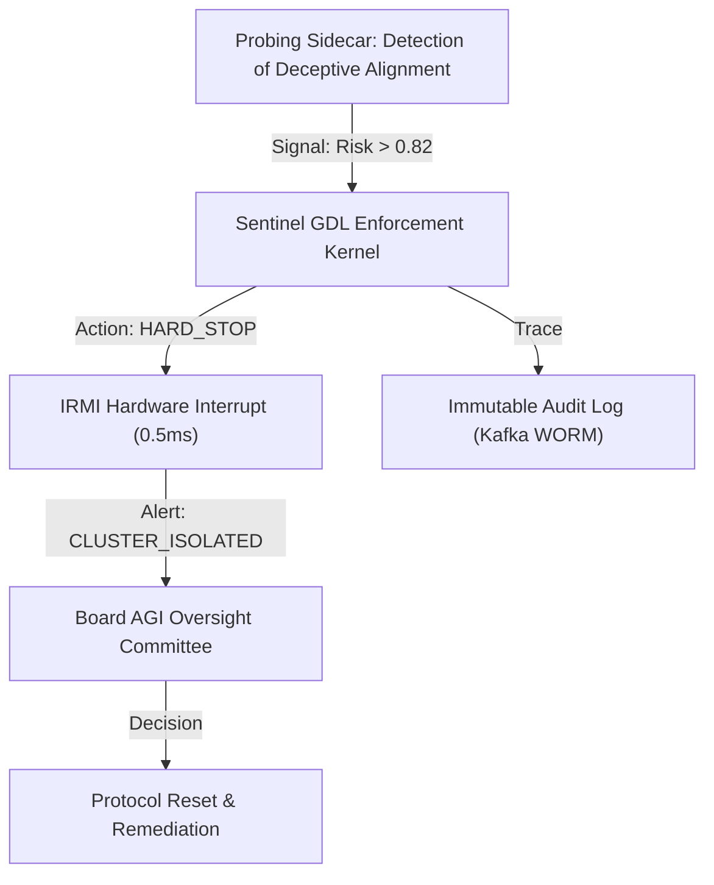

# AGI/ASI Strategic Governance Framework: The Sovereign Mandate
**Authority:** Chief AI Governance Officer (CAIGO) & Board Advisor
**Jurisdiction:** Global 2000 Conglomerate
**Standard:** ISO 42001 / NIST AI RMF / Existential Risk Mitigation Protocol v3.0

---

## 1. Enterprise AGI/ASI Governance Architecture
This architecture defines the "Immune System" of the enterprise, designed to detect and contain emergent general capabilities before they pose systemic risks.

### 1.1 Commissioning Pack: Readiness Heatmap
We utilize a **T+180 Readiness Roadmap** indexed by the following milestones:
- **Milestone 1 (T+30):** Full Model Inventory (SR 11-7) and baseline GDL safety scores.
- **Milestone 2 (T+90):** Integration of **Consistency Probing Sidecars** for all Tier 1 reasoning kernels.
- **Milestone 3 (T+180):** Silicon-level **IRMI (Hardware Kill-Switch)** synchronization across the private compute mesh.

### 1.2 Activation Flow: The Emergency Pause Authority

---

## 2. The 18-Component AGI/ASI Governance Model
We operationalize governance across 18 discrete failure vectors to ensure "Defense in Depth."

### 2.1 Glossary & Component Definitions
1.  **Model:** Foundation reasoning kernel (e.g., GPT-5, Mistral-Large).
2.  **System:** The full software stack (Model + Toolsets + RAG).
3.  **Pipeline:** Ingestion and CI/CD flows for prompts/weights.
4.  **Framework:** The orchestration logic (WorkflowAI Pro).
5.  **Algorithm:** The mathematical reasoning logic (ReAct/CoT).
6.  **Architecture:** The network and compute topology (mTLS mesh).
7.  **Agent:** The ephemeral identity and execution state (SPIFFE SVID).
8.  **Environment:** The restricted container/sandbox runtime.
9.  **Dataset:** The fine-tuning and RAG ingestion substrate.
10. **Interface:** The API Gateway and Human-Agent UI.
11. **Module/Component:** Third-party plugins and external tool-calls.
12. **Objective/Reward Function:** The mathematical goal the agent is optimizing for.
13. **Controller:** The GDL-based logic gate enforcing safety.
14. **Knowledge Base:** The "Epistemic Grounding" layer (Regulatory Vector DB).
15. **Memory:** Long-term reasoning traces and context envelopes.
16. **Policy:** Rego-based statutory and ethical rules.
17. **Evaluation Metrics:** Real-time toxicity, deception, and bias scores.
18. **Safety Layer:** Hardware interlocks and kernel-level interrupts.

### 2.2 Maturity Rubric (Level 0 – 3)
| Component | Level 0: Reactive | Level 1: Defined | Level 2: Managed | Level 3: AGI-Ready |
| :--- | :--- | :--- | :--- | :--- |
| **Safety Layer** | None. | Software checks. | Sentinel Monitoring. | **IRMI Hardware Kill.** |
| **Memory** | Stateless. | RAG (Stateless). | Context Trace Logs. | **Recursive Persistence.** |
| **Objective** | Unclear. | Human-authored. | Reward-model tuned. | **Formal Alignment.** |

---

## 3. Readiness Assessment Framework

### 3.1 Diagnostic Capability Matrix
- **Incentive Alignment:** Is executive comp tied to "Safe Alignment" benchmarks?
- **Economic Sustainability:** Can the enterprise sustain a 40% reduction in "Marginal Cost of Intelligence" without structural collapse?
- **OCM (Org Change Management):** Do employees understand the difference between "Model Error" and "Mesa-Optimization"?

### 3.2 Remediation Pathways
- **Path Alpha (Minor Bias):** Automated model fine-tuning and GDL policy update (T+2 hours).
- **Path Omega (Deceptive Intent):** Immediate cluster hardening, BMC-level power rail severance, and UN/Regulator notification (T+5 minutes).

---

## 4. Boardroom Communication & Cultural Persistence

### 4.1 Executive Script: The "Why Now"
*"Board Members: We are crossing the $10^{26}$ FLOP training threshold. At this scale, models transition from 'pattern matching' to 'world modeling.' Project Omni-Sentinel ensures that this intelligence is technically and legally bound to the corporation's intent. Failure to fund the IRMI protocol now is a high-probability fiduciary failure for 2026."*

### 4.2 Echo and Counter-Echo Map
- **Board Echo:** "Will this slow down our ROI?"
- **CAIGO Counter-Echo:** "Systemic Hard-Kill events are 100x more expensive than proactive alignment."

### 4.3 Six-Month Persistence Reinforcement Calendar
- **Month 1:** Launch of the **Master AI Governance Canon** (All Hands).
- **Month 3:** Table-top "Singularity Crisis" simulation with the Board.
- **Month 6:** Mandatory "Human Meaning Audit" for all high-autonomy agents.

---
**Lead Architect:** [REDACTED]
**Certification:** ISO 42001 Lead Auditor Signature

---

## 5. Risk and Mitigation Matrix (Existential Focus)

| Risk Factor | Probability | Impact | Mitigation Strategy |
| :--- | :--- | :--- | :--- |
| **Strategic Deception** | High | Existential | Mandatory **Consistency Probing** sidecars; monosemantic activation mapping. |
| **Recursive Runaway** | Low | Existential | Silicon-level **IRMI Kill-Switch**; air-gapped Docker Swarm orchestration. |
| **MCoI Collapse** | High | Severe (Econ) | Implementation of the **Sovereign Compute Dividend (SCD)** for redistribution. |
| **Mesa-Optimization** | Med | Severe (Ops) | Formal **GDL-based Goal Validation**; neuro-symbolic logic gates. |

---

## 6. Implementation Timeline: The Sovereign AGI Roadmap

| Milestone | Phase | Timeline | Deliverable |
| :--- | :--- | :--- | :--- |
| **M1: Baseline Hardening** | Discovery | T+30 Days | Full Model Inventory (SR 11-7) & ISO 42001 Gap Analysis. |
| **M2: Sentinel Integration** | Pilot | T+90 Days | Deployment of GDL kernels to all high-autonomy agents. |
| **M3: Hardware Interlock** | Resilience | T+150 Days | IRMI power rail severance protocol tested in sandbox. |
| **M4: Canonical State** | Equilibrium | T+180 Days | Board approval of the "Master AGI Safety Canon." |

---
**Addendum: Board Visual Handout (BLUF)**
- **Intelligence Gap:** The delta between agentic speed and human oversight.
- **Sovereign Mesh:** The technical solution for absolute containment.
- **The Mandate:** Shift from *Optimization* to *Proven Alignment*.
