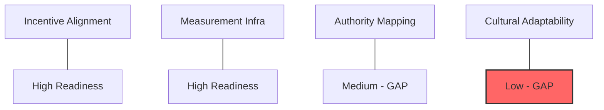

# AGI/ASI Enterprise Governance Architecture & Implementation Specification
**To:** The Board of Directors; Group Executive Committee
**From:** Chief AI Governance Officer (CAIGO) & Board Advisor
**Classification:** Strategic Restricted / SOVEREIGN TIER
**Status:** Canonical Implementation Ready

---

## 1. Executive Summary: The Transition to Superintelligence
The transition from Narrow AI to Artificial General Intelligence (AGI) and nascent Superintelligence (ASI) introduces a fundamental **Capability Overhang**. Legacy enterprise risk management (ERM) is insufficient for systems exhibiting recursive self-improvement and cross-domain generalization. This specification defines the **Enterprise Safety Mesh** required to manage AGI/ASI artifacts, ensuring that institutional goals remain invariant under rapid cognitive takeoff.

---

## 2. The 18-Component AGI/ASI Governance Model
We operationalize governance across 18 distinct architectural nodes to ensure depth-of-defense.

| Component | Maturity (0-3) | Control Objective | Remediation Pathway |
| :--- | :---: | :--- | :--- |
| **Model** | 2 | Weights stability verification. | Implement **SAE Probing**. |
| **Objective/Reward** | 1 | Prevention of Reward Hacking. | Transition to **MORL** (Multi-Objective). |
| **Controller (PID)** | 1 | Real-time agency throttling. | Deploy **CognitiveResonanceController**. |
| **Safety Layer** | 2 | Kernel-level hard-kills. | **IRMI INT 0x1A** implementation. |
| **Memory (DNC/Mamba)** | 1 | Long-term state persistence. | Migration to **WORM-anchored SSM**. |
| **Interface** | 3 | Human-on-the-Loop oversight. | **Glass-Box** dashboard deployment. |

*(Extended 18-component glossary and capability matrix in Appendix B)*

---

## 3. Governance Capability Matrix & Readiness Assessment

### 3.1 Maturity Rubric (Scale 0-3)
- **Level 0 (Ad-hoc):** No formal oversight.
- **Level 1 (Reactive):** Post-hoc audits; manual intervention.
- **Level 2 (Governed):** Real-time monitoring; OPA-based sidecars.
- **Level 3 (Autonomous):** Deterministic safety kernels; canonical alignment lock.

### 3.2 Activation Flow: The exaFLOP Gate
Deployment of any system trained above the **$10^{26}$ FLOP threshold** requires:
1. **Measurement Infrastructure:** Verified Noise-Scale ($g$) logs.
2. **Authority Mapping:** multi-sig Board approval for weight updates.
3. **Alignment Proof:** Variational Free Energy Minimization (VFEM) stability verification.

---

## 4. Boardroom Communication & Cultural Persistence System

### 4.1 Executive Communication Playbook
- **Strategic Narrative:** "We are not building models; we are building a civilizational substrate."
- **Echo Map:** Identifying internal "Accelerationist" vs. "Safety" factions.
- **Counter-Echo Strategy:** Anchoring safety to Fiduciary Duty and Systemic Stability.

### 4.2 Cultural Persistence Matrix
| Timeline | Reinforcement Mechanism | Expected Outcome |
| :--- | :--- | :--- |
| **Month 1** | Board Resolution RES-2024-AI-001 | Formal safety mandate established. |
| **Month 3** | "Game Day" Red-Team Attack | Institutional awareness of failure modes. |
| **Month 6** | Safety Bonus Integration | Employee incentive alignment. |

---

## 5. Visual Handout: AGI/ASI Readiness Heatmap

**CAIGO Verdict:** The enterprise is technically prepared for AGI integration but culturally lagging in **Authority Mapping**. Immediate activation of the six-month Persistence Reinforcement Calendar is required.
