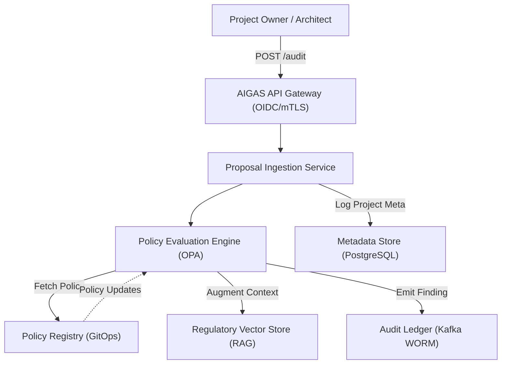

# Technical Specification: Automated AI Project Governance Audit System (AIGAS)
**Author:** Principal Cloud Architect & AI Governance Lead
**Regulatory Scope:** ISO/IEC 42001, NIST AI RMF, EU AI Act, GDPR
**Status:** Canonical Implementation Spec v1.0

---

## 1. System Overview & High-Level Architecture

AIGAS is a cloud-native platform designed to automate the regulatory vetting of AI project proposals. It intercepts project definitions during the design phase, evaluates them against a cryptographically signed Policy Registry, and persists findings to an immutable ledger for supervisory defensibility.

### 1.1 Architecture Diagram


---

## 2. Core Components

### 2.1 Ingestion Service
Normalizes unstructured proposal data into a canonical JSON structure. It performs initial complexity analysis and assigns a Risk Tier based on the project's domain (e.g., Clinical vs. Marketing).

### 2.2 Policy Evaluation Engine (OPA/Rego)
Utilizes **Open Policy Agent (OPA)** to execute **Governance-as-Code**. Policies are written in Rego and mapped to specific ISO 42001 clauses.
- **Example Rule:** `deny["High-risk model without PHI redaction"] { input.risk_tier == "HIGH"; not input.controls.pii_scrubbing }`

### 2.3 Audit Ledger (Immutable Log)
Implemented via a **Kafka-based WORM (Write Once Read Many)** topic. Every audit result is hashed and signed using a hardware-backed key (HSM), creating a non-repudiable "Ground Truth" for regulators.

---

## 3. Data Schemas

### 3.1 Input: AI Project Proposal Structure
```json
{
  "project_id": "UUID-V4",
  "metadata": {
    "name": "Predictive Diagnostic Alpha",
    "department": "Biomedical R&D",
    "target_jurisdiction": ["EU", "US"]
  },
  "technical_spec": {
    "model_type": "Dense Transformer",
    "data_sources": ["patient_records_v3"],
    "residency": "DE-Frankfurt"
  },
  "compliance_self_assessment": {
    "phi_redaction": true,
    "human_in_loop": true
  }
}
```

### 3.2 Output: Governance Report
```json
{
  "audit_id": "UUID-V4",
  "verdict": "CONDITIONAL_PASS",
  "violations": [
    {
      "clause": "ISO42001_A10.1",
      "severity": "CRITICAL",
      "reason": "Data residency in DE-Frankfurt requires explicit DPO sign-off for PHI."
    }
  ],
  "recommendations": ["Implement Cognito Sidecar for real-time redaction."]
}
```

---

## 4. API Design (REST)

- **`POST /v1/audit`**: Submits a proposal for automated evaluation.
- **`GET /v1/audit/{id}`**: Retrieves detailed findings and Merkle proof.
- **`GET /v1/policies`**: Lists active governance rules and their ISO mappings.
- **`POST /v1/policies/test`**: Dry-run for new Rego scripts.

---

## 5. Database Schema (PostgreSQL)

```sql
CREATE TABLE ai_projects (
    id UUID PRIMARY KEY,
    name TEXT NOT NULL,
    risk_tier VARCHAR(16) CHECK (risk_tier IN ('LOW', 'MEDIUM', 'HIGH', 'CRITICAL')),
    created_at TIMESTAMP DEFAULT CURRENT_TIMESTAMP
);

CREATE TABLE governance_policies (
    policy_id VARCHAR(64) PRIMARY KEY,
    iso_mapping VARCHAR(32),
    rego_payload TEXT NOT NULL,
    version INT DEFAULT 1
);

CREATE TABLE audit_findings (
    id UUID PRIMARY KEY,
    project_id UUID REFERENCES ai_projects(id),
    verdict VARCHAR(16),
    merkle_root VARCHAR(64),
    raw_response JSONB
);
```

---

## 6. CI/CD & Workflow Integration

AIGAS acts as a **Deployment Gate** in the enterprise SSDLC.
1.  **Trigger:** Developer pushes model metadata/config to GitLab.
2.  **Hook:** Pipeline calls `POST AIGAS/v1/audit`.
3.  **Enforcement:** If `verdict == FAIL`, the pipeline returns a non-zero exit code, blocking the merge and notifying the CMRO.
4.  **Evidence:** The audit result is linked to the build artifact for the lifecycle audit trail.

---

## 7. Security & Scalability

### 7.1 Security Pattern
- **Identity:** SPIFFE/SPIRE for service-to-service mTLS.
- **Secrets:** Integration with HashiCorp Vault for HSM key management.
- **PII Protection:** Input data is hashed before being stored in the Vector DB to prevent accidental PHI ingestion.

### 7.2 Scalability Strategy
- **Orchestration:** Deployed on GKE/EKS with **Horizontal Pod Autoscaling (HPA)** triggered by CPU/Memory spikes during batch audits.
- **Persistence:** Kafka partitions scaled across 3 Availability Zones for high-availability WORM logging.

---
**Certified by:** Global AI Governance Authority
