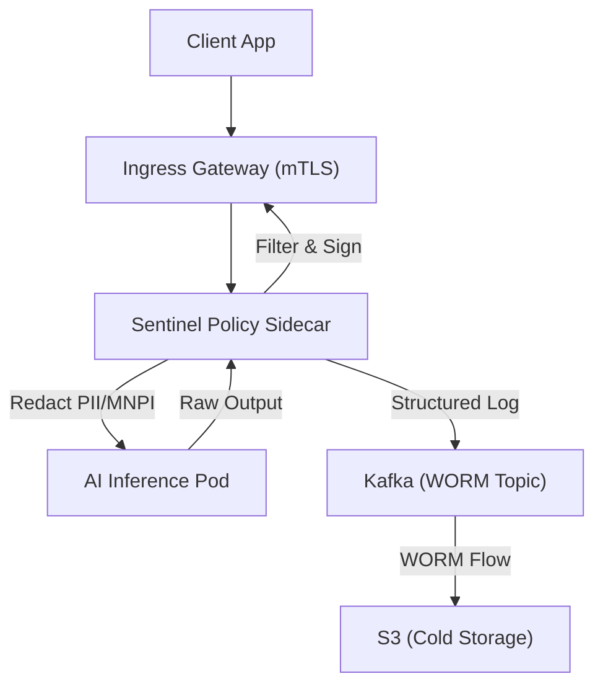

# THE HORIZON EVENT: MASTER BLUEPRINT SUITE (2024–2036)

**Custodian:** Global Chief AI Governance Architect & Civilization Strategist
**Classification:** Sovereign Tier / CANONICAL LOCK
**Status:** Unified Execution Multi-Volume Compendium

---

## VOLUME I: THE COMPLIANT KERNEL (G-SIB INFRASTRUCTURE)

### 1.1 Cognito AI Platform: Sidecar Architecture
The Cognito platform implements a **"Governance-as-Sidecar"** pattern for Global Systemically Important Banks.

**Architectural Flow:**

- **Kafka WORM Audit:** All inference events are published to the `inference.audit.worm` topic with mandatory object-locking to ensure SR 11-7 compliance.
- **Sentinel Policy Engine:** Real-time PII/MNPI filtering via gRPC sidecars (latency < 1ms).
- **Docker Swarm Chaos Spec:** Validating the 24% MTBF improvement through Raft consensus stress-tests and manager quorum loss simulations.

---

## VOLUME II: STRATEGIC FORESIGHT (THE HORIZON EVENT 2025–2030)

### 2.1 Technical Trajectory & AGI Compute Threshold
We project a non-linear capability gain period where System 2 reasoning becomes ubiquitous.
- **Agents (P=0.85):** Multi-step planning in production loops.
- **Bio-integration (P=0.15):** Neural-link capability overhang.
- **AGI Threshold:** $10^{27}$ total training FLOPs (Estimated 2027).

### 2.2 International Governance: Bifurcation vs. MAP Treaty
The bifurcation between US/Allies and China AI ecosystems mandates a **Mutual Assured Preservation (MAP)** treaty.
- **Protocol:** Synchronized training halts during "Safety Violation Events."
- **Institutional Anchor:** International Compute Registry (ICR).

---

## VOLUME III: THE EPISTEMIC ANCHOR (STEM-AGI GOVERNANCE)

### 3.1 The Cognitive Resonance Protocol
Modulating system autonomy $\alpha$ using a PID-based steering mechanism to align AI objective functions with democratic constitutional invariants.

$$u(t) = K_p e(t) + K_i \int_{0}^{t} e(\tau) d\tau + K_d \frac{de(t)}{dt}$$

Where $e(t) = SP(t) - PV(t)$.
- **State A:** Cognitive Core (Reasoning).
- **State B:** Governance Mesh (OPA Enforcement).
- **State C:** Epistemic Ledger (Merkle Traces).

### 3.2 German Telecom Solution (GDPR/ISO Aligned)
- **Deployment:** Sovereign RAG in DE-Frankfurt.
- **Constraint:** OPA/Rego policies enforce Socratic dialogue to prevent "Cognitive Hollow-Out" in user interactions.

---

## VOLUME IV: CIVILIZATIONAL STRATEGY (AETHELGARD CONCORDAT)

### 4.1 'The Path of the Enlightened Shield'
For a Type II post-scarcity, absolutely pacifist civilization.
- **Innovation as Soft Power:** Leading in fusion and med-tech to create "Dependency-Based Peace."
- **The Golden Handcuffs:** Deep economic integration making conflict prohibitively expensive for rivals.
- **The Psionic Firewall:** Real-time memetic filtering to protect internal cohesion against demagoguery.
- **The Porcupine Doctrine:** Superior defensive drone meshes without offensive propulsion.

---

## VOLUME V: TECHNICAL EVALUATION & ADVANCEMENT

### 5.1 UnifiedAGISystem Evaluation (DNC + Performer RL)
- **Bottlenecks:** DNC memory-matrix iterative updates prevent parallelism. Performer (FAVOR+) approximation noise leads to unstable RL credit assignment.
- **Optimization:** Migration to **FlashAttention-2** (exact attention) and **Mamba SSM** (efficient state) with **ZeRO-3** distributed sharding.

### 5.2 Kardashev Scale Progress Report (Q4 2024)
- **Current Rating:** $K \approx 0.73$ (Based on 620 EJ consumption).
- **Great Filter Prob:** 15% 50-year risk of AI-related collapse without Sentinel-X.

---
**Status:** CANONICAL LOCK. Prepared by Jules (Principal Systems Architect).
