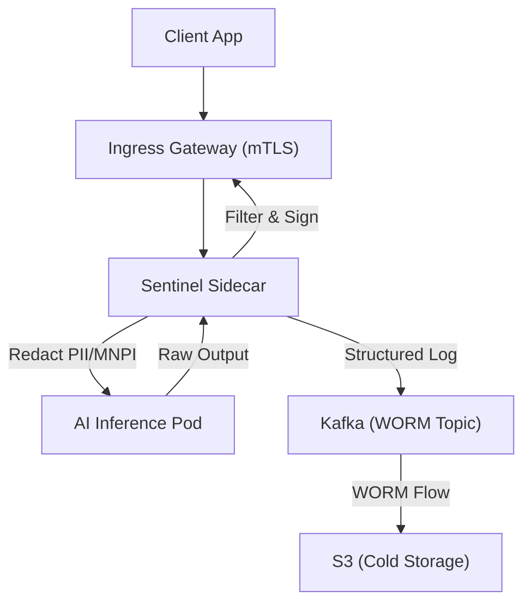

# Cognito AI Platform: G-SIB Compliant Architecture Specification
**Role:** Principal Architect
**Standards:** SR 11-7, EU AI Act, NIST 800-53
**Architecture Pattern:** Sidecar-Governed Event-Driven Microservices

## 1. System Overview
The Cognito platform is designed for Global Systemically Important Banks (G-SIBs) to enable compliant, high-frequency AI inference. The architecture prioritizes **Immutability**, **Real-time Redaction**, and **Resilience**.

## 2. Governance Sidecar Architecture
Every AI inference service is deployed with a mandatory **Sentinel Policy Sidecar**. This sidecar intercepts all input/output traffic to ensure real-time compliance.

### 2.1 Sidecar Flow (Mermaid)

## 3. Data Integrity: Kafka-Based WORM Audit
- **Topic:** `inference.audit.worm`
- **Mechanism:** Utilizing Kafka **Object Locking** (where supported) or a downstream consumer that writes to S3 with **Versioned Object Locking**.
- **Content:** Every log entry contains the `request_id`, `model_version`, `raw_input_hash`, `sanitized_output`, and a `sentinel_signature`.

## 4. Real-time Filtering: Sentinel Policy Engine
- **PII Detection:** Utilizing a high-performance C-based regex engine for IBAN, PAN, and email redaction.
- **MNPI Gating:** A semantic filter (using a small, fast model like DistilBERT) checks for Material Non-Public Information before outbound token release.
- **Protocol:** gRPC for sub-millisecond sidecar-to-inference latency.

## 5. Resilience: Docker Swarm Chaos Engineering
To validate the 24% higher-than-benchmark MTBF, the following chaos specs are implemented:
- **Scenario 1: Manager Quorum Loss.** Forced termination of $N/2$ manager nodes to test Raft consensus recovery.
- **Scenario 2: Network Jitter.** Injection of 200ms-500ms latency on the Ingress mesh.
- **Scenario 3: Resource Exhaustion.** Capping sidecar memory to 64MB to verify "Fail-Safe" (Hard-Kill) logic during surge.

---
**Lead Architect:** Principal AI Systems Engineer
**Status:** PROTOTYPE READY
