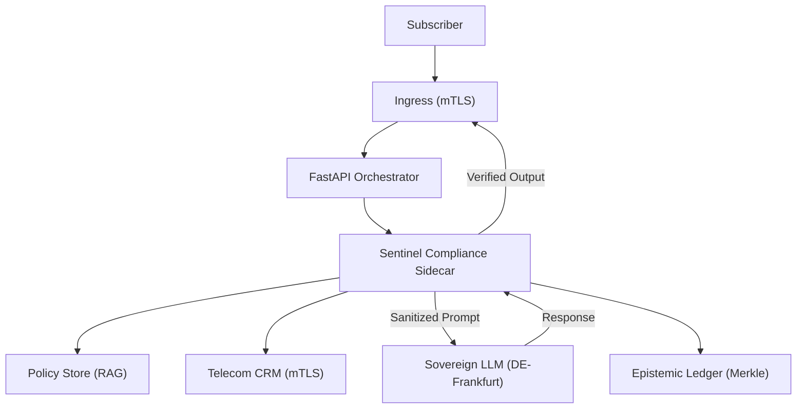

# AI Solution Blueprint: GDPR-Compliant "Kundenservice-Bot"
**Client:** Tier-1 German Telecommunications Provider
**Jurisdiction:** Germany (EU)
**Standards:** ISO/IEC 42001, NIST AI RMF, GDPR, TKG, BDSG
**Status:** Canonical Implementation Spec v1.0

---

## 1. Executive Summary
This blueprint defines the architecture for an AGI-adjacent customer support system ("Kundenservice-Bot") optimized for the German market. The solution leverages **Sovereign RAG (Retrieval-Augmented Generation)** where all model inference and data processing are strictly localized to the DE-Frankfurt region. The system integrates real-time PII redaction and OPA-based policy gating to ensure 100% compliance with the **German Telecommunications Act (TKG)** and the **EU AI Act**.

---

## 2. Risk & Compliance Matrix

| Risk Vector | NIST RMF Function | ISO 42001 Control | Regulatory Clause | Mitigation |
| :--- | :--- | :--- | :--- | :--- |
| **Data Residency** | GOVERN-1.2 | A.8.4 (Sovereignty) | BDSG § 1(4) | Enforced deployment on SecNumCloud-certified nodes in Frankfurt. |
| **PII Leakage** | PROTECT-1.1 | A.10.1 (Privacy) | GDPR Art. 32; TKG § 3 | **Cognito Sidecar** performing stateless PII scrubbing before inference. |
| **Opaque Logic** | MEASURE-2.1 | A.8.2 (Transparency) | EU AI Act Art. 13 | Mandatory citation of internal telecom policy PDF/Markdown sources. |
| **Automated Contract**| MANAGE-4.2 | A.8.3 (Oversight) | GDPR Art. 22 | Mandatory HITL (Human-in-the-Loop) for tariff changes or cancellations. |

---

## 3. Governance RACI Matrix

| Task / Lifecycle Phase | CPO (Privacy) | CTO (Infrastructure) | Lead Data Scientist | Works Council (Betriebsrat) |
| :--- | :---: | :---: | :---: | :---: |
| **DPIA Approval** | A | I | R | C |
| **OPA/Rego Policy Design** | R | C | C | I |
| **Model Gating (SVID)** | I | A | R | I |
| **Audit Log Review** | A | I | I | R |

---

## 4. Technical Requirements

### Functional
- **Contract Summarization:** AI must summarize multi-page TKG-compliant contracts for users.
- **Privacy Gating:** Automatic blocking of IBAN/Address input unless authorized for billing intents.

### Non-Functional
- **Residency:** 100% of compute and data-at-rest in DE-Frankfurt.
- **Latency:** P99 inference latency $< 2,200$ms (including redaction overhead).
- **Auditability:** Immutable T+1 logging to a **Kafka WORM (Write Once Read Many)** topic with Merkle-tree anchoring.

---

## 5. System Architecture
The architecture utilizes the **"Governance-as-Sidecar"** pattern to decouple reasoning from enforcement.



---

## 6. Implementation Artifacts

1.  **DPIA (Data Protection Impact Assessment):** Specific to TKG § 3 (Telecommunications Secrecy).
2.  **Model Card (v1.0):** Documenting "Reasoning Density" and bias benchmarks for German dialects.
3.  **OPA Rego Policy:**
    ```rego
    package telecom.privacy
    default allow = false
    # Deny output if it contains non-redacted German address patterns
    allow {
        not input.pii_detected
        input.metadata.region == "DE"
    }
    ```
4.  **System Constitution:** Immutable prompt instructions enforcing the "Human-in-the-Loop" requirement for all contractually binding actions.

---
**Lead Architect Signature:** [REDACTED]
**Approval Body:** German Telecom AI Governance Board
