# Enterprise AI Agent Interoperability Protocol (EAIP)

## 1. Necessity of Standardization
The rapid proliferation of autonomous agent swarms within enterprise infrastructure has introduced significant architectural entropy. Without a standardized communication protocol, organizations face "Agentic Entropy," characterized by:
- **Semantic Context Decay**: Bespoke handoffs between heterogeneous agents lead to "lossy" reasoning paths and hallucination cascades.
- **Integration Bloat**: $O(N^2)$ integration complexity between proprietary agent interfaces.
- **Security Voids**: A lack of non-repudiable identity for ephemeral agent workloads performing privileged tasks.
- **Governance Failure**: Inability to enforce deterministic safety guardrails across multi-vendor agent ecosystems.

Standardization via EAIP ensures semantic consistency, cryptographic identity, and scalable orchestration for HOTL (Human-on-the-Loop) systems.

## 2. API Architecture: Comparative Analysis and Recommendation
The transport layer must support high-concurrency, low-latency, and bidirectional streaming for negotiated reasoning loops.

| Feature | REST (OpenAPI/JSON) | WebSockets | gRPC (HTTP/2 + Protobuf) |
| :--- | :--- | :--- | :--- |
| **Serialization** | Text (High Overhead) | Variable | Binary (Highly Efficient) |
| **Contract Type** | Loose / Runtime | Implicit / Loose | Strict / Compile-time (IDL) |
| **Multiplexing** | No (HOL Blocking) | Native Support | Native Support |
| **Streaming** | Unidirectional Only | Full Duplex | Full Duplex / Bidirectional |
| **Efficiency** | Low | Medium | High (Sub-millisecond) |

**Definitive Recommendation: gRPC**
EAIP mandates gRPC as the canonical transport mechanism. The binary serialization of Protocol Buffers (Protobuf) reduces serialization/deserialization CPU cycles by up to 80% compared to JSON. Furthermore, gRPC’s native support for bidirectional streaming is essential for "Negotiated Reasoning," where two agents iteratively refine a task's parameters before final execution.

## 3. IAM for Autonomous Agents: SPIFFE/SPIRE
Traditional human-centric IAM (OAuth2/OIDC) is insufficient for autonomous agents operating at machine speed. EAIP implements **Machine Identity** via **SPIFFE (Secure Production Identity Framework for Everyone)**.

- **Workload Identity**: Each agent class is assigned a unique SPIFFE ID (e.g., `spiffe://trust.domain/ns/finance/agent/reconciler`).
- **Attestation**: The SPIRE agent on the host node performs workload attestation (binary hash, container image digest) before issuing an X.509 **SPIFFE Verifiable Identity Document (SVID)**.
- **Mutual TLS (mTLS)**: All EAIP communication occurs over mTLS. SVIDs provide both the identity and the cryptographic basis for encryption. SPIRE handles sub-hour certificate rotation, minimizing the blast radius of credential compromise.

## 4. State & Error Management
Agentic workflows require a formal mechanism for preserving reasoning state across heterogeneous boundaries.

### 4.1 Recursive Context Envelope (RCE)
To prevent context fragmentation, EAIP utilizes the **RCE**, a standardized metadata header injected into every gRPC call:
- **Trace Context**: W3C Trace Context compatible (TraceID/SpanID).
- **Reasoning Graph Hash**: A Merkle-root of the agent's internal reasoning steps, allowing the executor to hydrate context from a distributed store.
- **Capability Manifest**: A signed list of tools the dispatcher permits the executor to invoke.

### 4.2 Error Protocols and Standardized Fallbacks
EAIP maps gRPC status codes to deterministic agentic failure modes:
- `ERROR_AGENT_DIVERGENCE` (Status: `FAILED_PRECONDITION`): Executor plan violates dispatcher safety guardrails.
- `ERROR_CONTEXT_DRIFT` (Status: `DATA_LOSS`): The reasoning state has lost semantic coherence during transfer.
- `ERROR_HITL_REQUIRED` (Status: `UNAVAILABLE`): A logical deadlock has occurred requiring human intervention.

## 5. Reference Architecture Diagram

The sequence below illustrates a standardized task handoff between a Dispatcher Agent and an Executor Agent utilizing EAIP.

```mermaid
sequenceDiagram
    participant D as Dispatcher Agent
    participant S as SPIRE Server
    participant E as Executor Agent
    participant O as Policy Engine (OPA)

    Note over D,E: EAIP gRPC mTLS Handshake
    D->>S: Fetch SVID (Agent Identity)
    S-->>D: Identity Document (X.509)
    D->>E: ExecuteTask(RCE + Payload)
    E->>S: Validate Dispatcher SVID
    S-->>E: Identity Verified
    E->>O: Check Authorization (RCE Scope)
    O-->>E: Policy Permit (Max Budget: $100)
    rect rgb(20, 20, 20)
    Note right of E: Autonomous Reasoning Loop
    E->>E: Process Request
    end
    E-->>D: TaskResult (Updated RCE)
```

