# Enterprise AI Agent Interoperability Protocol (EAIP) v1.0

## 1. Necessity of Standardization: Resolving Agentic Entropy

The rapid transition from assistive "Co-pilot" models to autonomous "Agentic Swarms" has introduced a critical architectural failure point: **Agentic Entropy**. Current enterprise AI deployments rely on bespoke, opaque integrations that lead to $O(N^2)$ complexity and "Reasoning Silos." Standardization via EAIP is the prerequisite for:

- **Semantic Cohesion**: Preventing "Context Drift" and "Hallucination Cascades" where downstream agents receive lossy summaries of original user intent.
- **Machine-Scale Efficiency**: Eliminating the CPU/memory overhead of text-based serialization (JSON) in high-frequency recursive reasoning loops.
- **Forensic Auditability**: Ensuring non-repudiation by binding every autonomous tool-call to a cryptographically verified machine identity.
- **Governance Enforceability**: Enabling "Policy-as-a-Proxy" where sidecar engines (e.g., OPA) intercept agent traffic to enforce deterministic safety guardrails.

## 2. API Architecture: The gRPC/HTTP2 Mandate

The transport layer defines the operational ceiling for agentic performance. EAIP strictly mandates **gRPC over HTTP/2** for its binary efficiency and multiplexing capabilities.

### 2.1 Comparative Analysis
| Feature | REST (JSON/HTTP1.1) | WebSockets | gRPC (Protobuf/HTTP2) |
| :--- | :--- | :--- | :--- |
| **Serialization** | Text-based (Bloated) | Variable | Binary (Highly Efficient) |
| **Contract** | Loose (OpenAPI) | Implicit | Strict (IDL/Proto3) |
| **Multiplexing** | No (HOL Blocking) | Native | Native (Single TCP Conn) |
| **Streaming** | Unidirectional Only | Full Duplex | Bidirectional / Multi-stream |

### 2.2 Protocol Buffer Implementation (Conceptual)
```protobuf
syntax = "proto3";
package eaip.v1;

service AgentOrchestrator {
  // Primary bidirectional stream for negotiated reasoning
  rpc ExecuteTask(stream TaskEnvelope) returns (stream TaskResponse);

  // High-frequency health and alignment monitoring
  rpc AlignmentHeartbeat(HeartbeatRequest) returns (HeartbeatResponse);
}

message TaskEnvelope {
  string task_id = 1;
  string parent_agent_svid = 2;
  RecursiveContextEnvelope context = 3;
  bytes domain_payload = 4;
}
```

## 3. IAM for Autonomous Agents: SPIFFE/SPIRE Architecture

Traditional human-centric IAM (OAuth2/OIDC) is insufficient for agents spawning at machine speeds. EAIP leverages **SPIFFE (Secure Production Identity Framework for Everyone)**.

- **Workload Identity**: Each agent is assigned a unique **SPIFFE ID** based on its logical function and department (e.g., `spiffe://enterprise.com/ns/finance/agent/tax-reconciler`).
- **Attestation**: The **SPIRE** agent perform workload attestation (binary hash verification, container image digest) before issuing an X.509 **SPIFFE Verifiable Identity Document (SVID)**.
- **Mutual TLS (mTLS)**: All EAIP communication occurs over mTLS. SVIDs provide both the identity and the cryptographic basis for encryption. SPIRE handles automatic certificate rotation (sub-60 minute intervals), minimizing the impact of credential theft.

## 4. State & Error Management: The Recursive Context Envelope (RCE)

The primary failure mode in distributed AI is context fragmentation. EAIP introduces the **RCE** protocol.

### 4.1 Recursive Context Envelope (RCE)
The RCE is a standardized metadata header accompanying every gRPC call, utilizing a **Merkle-DAG** structure to ensure:
- **Global Trace Context**: W3C Trace Context compatible (TraceID/SpanID) for end-to-end swarm observability.
- **Reasoning Provenance**: A cryptographic hash-link to a distributed context store (e.g., Vector DB), allowing the receiver to "hydrate" only the necessary reasoning fragments.
- **Recursion Guard**: An integer TTL to prevent infinite delegation loops or "Recursive Resource Exhaustion."

### 4.2 Standardized Error Taxonomy
EAIP defines deterministic mappings for agent failure modes:
- `ERROR_AGENT_DIVERGENCE` (Status: `FAILED_PRECONDITION`): Executor plan violates dispatcher safety guardrails.
- `ERROR_CONTEXT_DRIFT` (Status: `DATA_LOSS`): RCE integrity failure or semantic coherence breach.
- `ERROR_HITL_REQUIRED` (Status: `UNAVAILABLE`): A terminal logical deadlock requiring human operator intervention.

## 5. Reference Architecture Diagram

```mermaid
sequenceDiagram
    participant D as Dispatcher Agent
    participant S as SPIRE Server
    participant E as Executor Agent
    participant G as Governance Engine (GDL/OPA)

    Note over D, E: EAIP gRPC mTLS Handshake
    D->>S: Fetch SVID (Agent ID)
    S-->>D: Identity Document (X.509)
    D->>E: ExecuteTask(RCE + DomainPayload)
    E->>S: Validate Dispatcher SVID
    S-->>E: Identity Verified
    E->>G: Check Authorization (RCE Scope)
    G-->>E: Policy Permit (Budget: $500)

    rect rgb(30, 30, 30)
    Note right of E: Autonomous Reasoning Loop
    E->>E: Task Execution / Tool Calling
    end

    alt Success
        E-->>D: TaskResponse(Success + Updated RCE)
    else Failure (Constraint Violation)
        E-->>D: TaskResponse(ERROR_AGENT_DIVERGENCE)
    end
```


