# 1. Necessity of Standardization: Drivers for A2A Interoperability

The proliferation of autonomous agentic swarms within enterprise infrastructure has introduced critical architectural failure points collectively defined as **Agentic Entropy**. Current bespoke integrations between heterogeneous agents result in $O(n^2)$ complexity and brittle orchestration patterns. Standardization via EAIP is mandated to address the following technical and business drivers:

- **Computational Efficiency**: At enterprise scale, the serialization overhead of text-based protocols (REST/JSON) results in significant CPU cycle waste and latency bloat during high-frequency recursive reasoning loops.
- **Semantic Continuity**: "Lossy" handoffs lead to context fragmentation and "hallucination cascades." Standardizing the state vector transfer ensures reasoning provenance is preserved across multi-agent chains.
- **Non-Repudiation**: For autonomous agents to perform high-value tasks (e.g., financial reconciliation or infrastructure modification), every interaction must be bound to a cryptographically verifiable workload identity.
- **Governance Enforceability**: Enabling "Policy-as-a-Proxy" where sidecar engines (e.g., OPA) intercept agent traffic to enforce deterministic safety guardrails.

# 2. API Architecture: The gRPC Mandate

The transport layer defines the operational ceiling for agentic ecosystems. Agentic workflows require high-concurrency, low-latency, and native support for long-running bidirectional reasoning tasks.

### 2.1 Comparative Analysis
| Feature | REST (OpenAPI/JSON) | WebSockets | gRPC (HTTP/2 + Protobuf) |
| :--- | :--- | :--- | :--- |
| **Serialization** | Text-based (Inconsistent) | Variable | Binary (Highly Efficient) |
| **Contract Type** | Loose / Runtime | Implicit / Custom | Strict / Compile-time (IDL) |
| **Multiplexing** | No (HOL Blocking) | Native | Native (Single TCP Conn) |
| **Streaming** | Unidirectional Only | Full Duplex | Bidirectional / Multi-stream |

### 2.2 Recommendation: gRPC
**EAIP strictly mandates gRPC as the canonical transport protocol.**
The Protocol Buffers (Protobuf) binary format provides up to an 80% reduction in payload size and sub-millisecond serialization speeds. gRPC’s native support for bidirectional streaming facilitates **Negotiated Reasoning Streams (NRS)**, where agents iteratively refine task parameters over a single persistent connection, eliminating the latency penalties of repeated TLS handshakes.

# 3. IAM for Autonomous Agents: SPIFFE/SPIRE Architecture

Standard human-centric identity models (OAuth2/OIDC) fail at machine speeds. EAIP leverages **Machine Identity** via **SPIFFE (Secure Production Identity Framework for Everyone)**.

- **Workload Identity (SPIFFE ID)**: Each agent class is assigned a unique, platform-agnostic identity following a hierarchical namespace (e.g., `spiffe://trust.domain/ns/finance/agent/reconciler`).
- **Attestation**: The **SPIRE** agent on the host performs multi-modal attestation, verifying binary hash, container image digest, and runtime metadata before issuing credentials.
- **Mutual TLS (mTLS)**: All EAIP communication terminates Mutual TLS (mTLS). Agents utilize short-lived X.509 **SPIFFE Verifiable Identity Documents** (SVIDs). SPIRE handles automatic certificate rotation (e.g., every 60 minutes), minimizing the blast radius of potential credential compromise.

# 4. State & Error Management: The RCE Protocol

EAIP introduces the **Recursive Context Envelope (RCE)** for state management and context handoffs.

### 4.1 Recursive Context Envelope (RCE)
The RCE is a standardized metadata header accompanying every EAIP call. It utilizes a **Merkle-DAG** structure:
- **Trace Context**: W3C Trace Context compatible (TraceID/SpanID) for end-to-end swarm observability.
- **Reasoning Provenance**: A cryptographic hash-link to the distributed context store, allowing the receiver to "hydrate" only relevant reasoning fragments.
- **Recursion Guard**: An integer TTL to prevent infinite reasoning loops or "Agent Sprawl."

### 4.2 Error Taxonomy
EAIP defines deterministic mappings of gRPC status codes to agent failure modes:
- `ERROR_AGENT_DIVERGENCE` (Status: `FAILED_PRECONDITION`): Executor plan violates dispatcher safety guardrails.
- `ERROR_CONTEXT_DRIFT` (Status: `DATA_LOSS`): RCE integrity or semantic coherence failure.
- `ERROR_HITL_REQUIRED` (Status: `UNAVAILABLE`): A terminal logical deadlock requiring human intervention.

# 5. Reference Architecture Diagram

```mermaid
sequenceDiagram
    participant Disp as Dispatcher Agent
    participant SPIRE as SPIRE Authority
    participant Exec as Executor Agent
    participant OPA as Policy Engine (OPA)

    Note over Disp, Exec: Both agents attested via SPIRE

    Disp->>SPIRE: Fetch SVID (X.509)
    SPIRE-->>Disp: SVID Issued

    Disp->>Exec: gRPC ExecuteTask(RCE + Payload) [mTLS]

    Exec->>SPIRE: Validate Dispatcher SVID
    SPIRE-->>Exec: Identity Verified

    Exec->>OPA: Check Authorization (SVID + RCE Scope)
    OPA-->>Exec: Policy Permit (Max Budget: $100)

    rect rgb(20, 20, 20)
    Note right of Exec: Autonomous Reasoning Loop
    Exec->>Exec: Process Request
    end

    alt Success
        Exec-->>Disp: TaskResponse(Success + Updated RCE)
    else Failure (Constraint Violation)
        Exec-->>Disp: TaskResponse(ERROR_AGENT_DIVERGENCE)
    end
```

