# 1. Necessity of Standardization

The transition from assistive "Co-pilot" models to autonomous "Agentic Swarms" has introduced a critical failure point: **Agentic Entropy**. Current enterprise AI deployments rely on bespoke, non-standardized integrations that lead to $O(n^2)$ complexity and "Reasoning Silos." Standardization via the EAIP is mandated for the following technical and business drivers:

- **Computational Efficiency**: Text-based protocols (REST/JSON) incur prohibitive serialization overhead in high-frequency recursive reasoning loops. EAIP eliminates this waste.
- **Semantic Cohesion**: "Lossy" handoffs lead to context drift and hallucination cascades. Standardizing the state vector transfer ensures that intent and reasoning provenance are preserved across heterogeneous agent boundaries.
- **Non-Repudiation**: Privileged autonomous actions (e.g., financial reconciliation or infrastructure modification) require cryptographically verifiable identities for forensic auditability and real-time policy enforcement.
- **Inter-Vendor Portability**: Decoupling the "Orchestrator" from the "Worker" agents via a uniform protocol prevents vendor lock-in and enables modular capability discovery.

# 2. API Architecture: Comparative Analysis and Mandate

The transport layer defines the operational ceiling for agentic ecosystems. Agentic workflows require high-concurrency, low-latency, and native bidirectional streaming for negotiated reasoning.

### 2.1 Comparative Analysis
| Feature | REST (OpenAPI/JSON) | WebSockets | gRPC (HTTP/2 + Protobuf) |
| :--- | :--- | :--- | :--- |
| **Serialization** | Text-based (Bloated) | Variable (Untyped) | Binary (Highly Efficient) |
| **Contract** | Loose / Runtime | Implicit / Custom | Strict / Build-time (IDL) |
| **Multiplexing** | No (HOL Blocking) | Native | Native (Single TCP Conn) |
| **Streaming** | Unidirectional Only | Full Duplex | Full Duplex / Multi-stream |

### 2.2 Recommendation: gRPC
**EAIP strictly mandates gRPC as the canonical transport protocol.**
Protocol Buffers (Protobuf) binary serialization reduces payload size by up to 80% compared to JSON. HTTP/2's multiplexing allows multiple concurrent "thought channels" and tool-calling flows to persist over a single TCP connection, eliminating the handshake latency inherent in RESTful patterns.

# 3. IAM for Autonomous Agents: SPIFFE/SPIRE Architecture

Standard human-centric identity models (OAuth2/OIDC) fail at machine speeds. EAIP implements **Machine Identity** via **SPIFFE (Secure Production Identity Framework for Everyone)**.

- **Workload Identity (SPIFFE ID)**: Each agent class is assigned a unique, platform-agnostic identity (e.g., `spiffe://trust.domain/ns/finance/agent/reconciler`).
- **Identity Issuance**: The **SPIRE** agent on the host performs workload attestation (verifying binary hash, container image digest, and namespace) before issuing credentials.
- **SVID and mTLS**: Agents are issued short-lived X.509 **SPIFFE Verifiable Identity Documents** (SVIDs). All EAIP traffic must terminate Mutual TLS (mTLS). SPIRE handles automatic certificate rotation (e.g., < 60 minutes), minimizing the blast radius of potential credential compromise.

# 4. State & Error Management: The Recursive Context Envelope (RCE)

EAIP introduces the **Recursive Context Envelope (RCE)** for state management and context handoffs.

### 4.1 State Preservation (RCE)
The RCE is a standardized metadata header accompanying every EAIP call. It utilizes a **Merkle-DAG** structure to ensure context integrity:
- **Trace Context**: W3C Trace Context compatible (TraceID/SpanID) for end-to-end swarm observability.
- **Reasoning Provenance Hash**: A cryptographic link to a distributed context store (e.g., Redis or Vector DB), allowing the receiver to "hydrate" only relevant reasoning fragments.
- **Recursion Guard**: An integer TTL for agentic delegation to prevent infinite reasoning loops or "Agent Sprawl."

### 4.2 Error Taxonomy
EAIP defines deterministic mappings of gRPC status codes to agentic failure modes:
- `ERROR_AGENT_DIVERGENCE` (Status: `FAILED_PRECONDITION`): Executor plan violates dispatcher safety guardrails.
- `ERROR_CONTEXT_DRIFT` (Status: `DATA_LOSS`): The RCE failed integrity verification or semantic coherence checks.
- `ERROR_HITL_REQUIRED` (Status: `UNAVAILABLE`): A terminal logical deadlock requiring human intervention.

# 5. Reference Architecture Diagram

The following sequence illustrates a standardized task handoff using the EAIP protocol with SPIFFE identity verification and RCE context management.

```mermaid
sequenceDiagram
    participant Disp as Dispatcher Agent
    participant SPIRE as SPIRE Authority
    participant Exec as Executor Agent
    participant OPA as Policy Engine (OPA)

    Note over Disp, Exec: Both agents attested via SPIRE

    Disp->>SPIRE: Fetch SVID (X.509)
    SPIRE-->>Disp: SVID Issued

    Disp->>Exec: gRPC ExecuteTask(RCE + Payload) [mTLS]

    Exec->>SPIRE: Validate Dispatcher SVID
    SPIRE-->>Exec: Identity Verified

    Exec->>OPA: Check Authorization (SVID + RCE Scope)
    OPA-->>Exec: Policy Permit (Max Budget: $100)

    rect rgb(30, 30, 30)
    Note right of Exec: Autonomous Reasoning Loop
    Exec->>Exec: Process Request
    end

    alt Success
        Exec-->>Disp: TaskResponse(Success + Updated RCE)
    else Failure (Constraint Violation)
        Exec-->>Disp: TaskResponse(ERROR_AGENT_DIVERGENCE)
    end
```

