# Enterprise AI Agent Interoperability Protocol (EAIP) v1.0

## 1. Necessity of Standardization

The proliferation of autonomous agentic workloads within enterprise infrastructure has introduced critical architectural failure points collectively defined as **Agentic Entropy**. Current bespoke integrations between heterogeneous agents result in $O(n^2)$ complexity and brittle orchestration patterns. Standardization via EAIP is mandated to address:

- **Semantic Context Integrity**: Preventing "Hallucination Cascades" where downstream agents make decisions based on lossy or corrupted context handoffs.
- **Computational Efficiency**: At scale, the serialization overhead of text-based protocols (REST/JSON) results in prohibitive CPU cycle waste during recursive reasoning loops.
- **Security & Non-Repudiation**: For autonomous agents to perform privileged actions (e.g., executing financial trades), every action must be traceable to a cryptographically verified workload identity.
- **Operational Resilience**: Standardizing error-handling and fallback mechanisms to prevent infinite delegation loops or "Agent Sprawl."

## 2. API Architecture: Comparative Analysis and Recommendation

The transport layer must support high-concurrency, low-latency, and bidirectional streaming for long-running reasoning tasks.

| Feature | REST (OpenAPI/JSON) | WebSockets | gRPC (HTTP/2 + Protobuf) |
| :--- | :--- | :--- | :--- |
| **Serialization** | Text-based (Inconsistent) | Variable | Binary (Highly Efficient) |
| **Contract Type** | Loose / Runtime | Implicit / Custom | Strict / Compile-time (IDL) |
| **Multiplexing** | No (Head-of-Line Blocking) | Native | Native (Single TCP Conn) |
| **Streaming** | Unidirectional Only | Full Duplex | Full Duplex / Multi-stream |

### Recommendation: gRPC
**EAIP strictly mandates gRPC as the primary transport layer.**
The binary serialization of Protocol Buffers (Protobuf) reduces payload size by up to 80% compared to JSON. Furthermore, gRPC’s native support for bidirectional streaming facilitates **Negotiated Reasoning Streams (NRS)**, where agents iteratively refine task parameters over a single persistent connection, eliminating the latency penalties of repeated TLS handshakes.

## 3. IAM for Autonomous Agents: SPIFFE/SPIRE

Standard human-centric identity models (OAuth2/OIDC) fail at the scale of autonomous agents. EAIP leverages **Machine Identity** via **SPIFFE (Secure Production Identity Framework for Everyone)**.

- **Workload Identity (SPIFFE ID)**: Each agent instance is assigned a unique, non-IP-based identity: `spiffe://trust.domain/ns/{dept}/agent/{class}/{id}`.
- **Attestation**: The **SPIRE** agent on the node performs workload attestation (verifying binary hash, container digest, and environment metadata) before issuing an X.509 **SPIFFE Verifiable Identity Document (SVID)**.
- **mTLS Enforcement**: All EAIP communication occurs over Mutual TLS (mTLS). SVIDs serve as both the identity and the cryptographic basis for encryption. SPIRE handles automatic certificate rotation (e.g., every 60 minutes), minimizing the blast radius of potential credential compromise.

## 4. State & Error Management: The RCE Protocol

EAIP introduces the **Recursive Context Envelope (RCE)** for state management.

### 4.1 Recursive Context Envelope (RCE)
The RCE is a standardized metadata header accompanying every EAIP call. It utilizes a **Merkle-DAG** structure to ensure context integrity:
- **Trace Context**: W3C Trace Context compatible (TraceID/SpanID) for end-to-end observability across agent swarms.
- **Reasoning Graph Hash**: A cryptographic link to a distributed context store (e.g., Redis or Vector DB), allowing the receiver to "hydrate" only the necessary reasoning fragments.
- **Recursion Guard**: An integer TTL for agentic delegation to prevent infinite reasoning loops.

### 4.2 Standardized Error Taxonomy
EAIP defines deterministic mappings of gRPC status codes to agent failure modes:
- `ERROR_AGENT_DIVERGENCE` (Status: `FAILED_PRECONDITION`): Executor plan violates dispatcher safety guardrails.
- `ERROR_CONTEXT_DRIFT` (Status: `DATA_LOSS`): The RCE failed integrity verification or semantic coherence check.
- `ERROR_HITL_REQUIRED` (Status: `UNAVAILABLE`): A terminal logical deadlock requiring human intervention.

## 5. Reference Architecture Diagram

The sequence below illustrates a task handoff using the EAIP protocol with SPIFFE identity verification and RCE context management.

```mermaid
sequenceDiagram
    participant Disp as Dispatcher Agent
    participant SPIRE as SPIRE Authority
    participant Exec as Executor Agent
    participant OPA as Policy Engine (OPA)

    Note over Disp, Exec: Both agents attested via SPIRE

    Disp->>SPIRE: Fetch SVID (X.509)
    SPIRE-->>Disp: SVID Issued

    Disp->>Exec: gRPC ExecuteTask(RCE + Payload) [mTLS]

    Exec->>SPIRE: Validate Dispatcher SVID
    SPIRE-->>Exec: Identity Verified

    Exec->>OPA: Check Authorization (SVID + RCE Scope)
    OPA-->>Exec: Policy Permit (Max Budget: $100)

    rect rgb(30, 30, 30)
    Note right of Exec: Autonomous Reasoning Loop
    Exec->>Exec: Process Request
    end

    alt Success
        Exec-->>Disp: TaskResponse(Success + Updated RCE)
    else Failure (Constraint Violation)
        Exec-->>Disp: TaskResponse(ERROR_AGENT_DIVERGENCE)
    end
```

