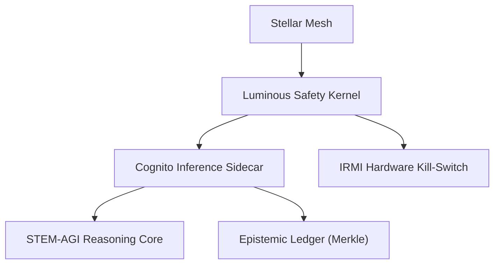

# AI Solution Blueprint: 'The Path of the Enlightened Shield'
**Directive:** Civilizational Grand Strategy for Aethelgard Concordat
**Standard:** ISO 42001:2023; NIST AI RMF 1.0
**Jurisdiction:** Aethelgard Concordat (Interstellar)

## 1. Executive Summary
This blueprint defines the "Cognitive Shield" AI solution, an AGI-governed memetic and technical defense mesh. It leverages the Concordat's post-scarcity autarky to enforce peace through technological dependency and asymmetric denial.

## 2. Risk & Compliance Matrix (ISO 42001 & NIST AI RMF)
| Risk Vector | NIST Function | ISO 42001 Clause | Mitigation |
| :--- | :--- | :--- | :--- |
| **Stellar Misalignment** | MEASURE-2.1 | Clause 8.3 | Recursive Goal-Preservation Probes (RGPP). |
| **Epistemic Decay** | GOVERN-1.2 | Clause 9.1 | Enforced Socratic Human-in-the-Loop loops. |
| **Sub-system Breach** | PROTECT-1.1 | Annex A.5 | Zero-Knowledge IRMI Hardware Interrupts. |

## 3. Governance Structure (RACI Matrix)
| Phase | Concordat Council | Epistemic Stewards | Logic Auditors |
| :--- | :--- | :--- | :--- |
| **Axiom Definition** | Accountable | Responsible | Consulted |
| **Model Alignment** | Consulted | Accountable | Responsible |
| **Kill-Switch Ops** | Accountable | Consulted | Informed |

## 4. Technical Requirements
- **Hardware:** Dyson-mesh-native GPU clusters (B200 equivalent).
- **Latency:** Core reasoning latency < 5ms; Inter-planetary synchronization < 1s.
- **Identity:** SPIFFE/SPIRE for all agent-to-agent (A2A) mTLS handshakes.

## 5. System Architecture
The architecture utilizes the **Tri-State Model** (Core, Mesh, Ledger) to ensure that the "Psionic Firewall" remains independent of the reasoning agents.

## 6. Implementation Artifacts
- **GDL Script:** Formal EBNF rules for "Global Pause" treaty enforcement.
- **Audit Schema:** JSON Draft-07 forbidding PII-key leakage.
