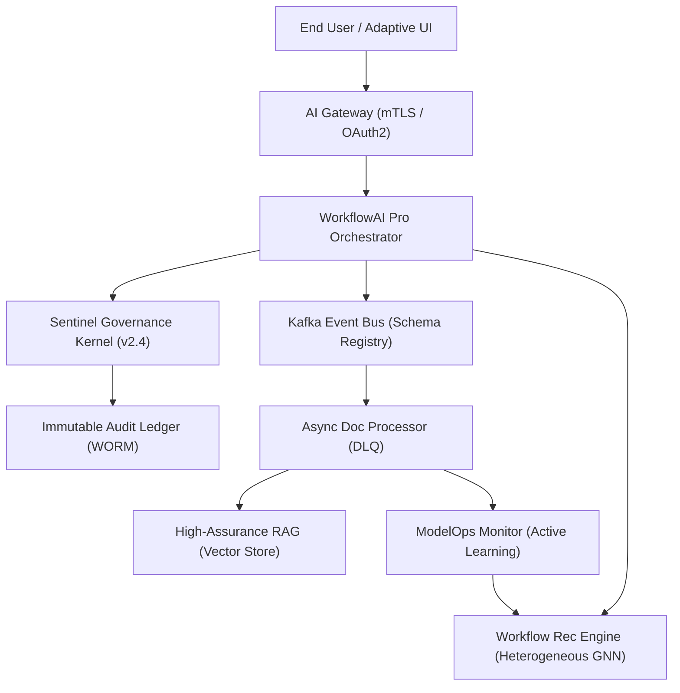
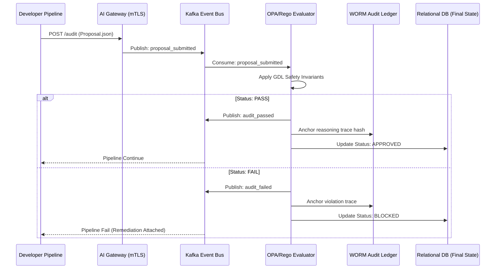

# Enterprise AI Governance Platform: Implementation Plan & Architecture Analysis
**Version:** 1.1.0
**Target Audience:** Board, CTO, CISO, Lead Enterprise Architects

<title>Implementation Strategy & Reference Architecture for the Enterprise AI-OS</title>

<abstract>
This document provides a comprehensive implementation roadmap and architecture analysis for the Enterprise AI-OS, a high-assurance platform integrating task management, RAG-driven reporting, and neuro-symbolic governance. The plan defines a three-phased rollout (2025–2027) focused on scaling distributed AI workflows while maintaining strict compliance with ISO 42001, the EU AI Act, and GDPR. Key technical pillars include Kafka-based event streaming, heterogeneous graph neural networks for workflow recommendation, and adaptive cognitive-load-aware user interfaces.
</abstract>

<content>

## 1. High-Level Architecture Analysis
The platform adopts a **Distributed Neuro-Symbolic Agentic Architecture**, decoupling the orchestration of tasks (WorkflowAI Pro) from the enforcement of safety (Sentinel v2.4).

### 1.1 Architecture Diagram

### 1.2 Core Data Flow Description
1.  **Ingestion & State Management:** Tasks and documents are ingested via the **Kafka Event Bus**. The **Schema Registry** enforces payload integrity. Failed jobs are routed to a **Dead Letter Queue (DLQ)** for automated retry or manual review.
2.  **Intelligence Synthesis:** The **Heterogeneous GNN** analyzes the graph of users, tasks, and successful reports to provide proactive workflow recommendations.
3.  **Governance Interdiction:** Every prompt and sub-task handoff is intercepted by **Sentinel v2.4** for GDL-based safety scoring before being sent to the foundation model kernel.
4.  **Epistemic Persistence:** Inference results are stored in the **Vector DB** for RAG, while a cryptographic hash of the reasoning trace is anchored to the **Kafka WORM Ledger** for regulatory non-repudiation.

## 2. Phased Implementation Roadmap (2025–2027)

### Phase 1: Foundational Management & Security (Q1 - Q2 2025)
*Goal: Establish the management skeleton and compliance baseline.*
- **Task Fabric:** Core CRUD for tasks, **due dates**, and **Calendar View** integration.
- **RBAC & Compliance:** Four-tier administration model (Global, Dept, Project, Auditor). Encryption at rest (AES-256) and transit (mTLS).
- **Asynchronous Backbone:** Deployment of the Kafka cluster with schema enforcement for document processing.
- **Report Versioning:** Implementation of Git-based version control for Markdown-based AI report drafts and **Multi-Format Export** (PDF/DOCX/JSON).

### Phase 2: AI Augmentation & Governance Interoperability (Q3 2025 - Q1 2026)
*Goal: Inject intelligence and standardized safety gates.*
- **Intelligent Orchestration:** **Task Dependency Tracking** and **Drag-and-Drop** workflow visualizer using React Flow.
- **Prompt IDE:** Integrated development environment with real-time **GDL Safety Scoring** and automated **Model Selection** (GPT-4o vs. Mistral local).
- **Workflow Prediction:** Deployment of the **HGNN v1** for proactive task suggestions based on historical "Path to Approval."
- **Governance Dashboards:** Real-time visibility into "Deception Index" and "Toxicity" telemetry.

### Phase 3: Cognitive Adaptivity & Ecosystem Scaling (Q2 2026 - 2027)
*Goal: Reach AGI-ready autonomous excellence.*
- **Adaptive UI Engine:** React components that dynamically restructure their layout and complexity based on real-time **Cognitive Load** metrics (time-to-action, error rate).
- **Active Learning & ModelOps:** Automated retraining of RAG indices and HGNN weights based on Human-in-the-Loop (HITL) feedback from rejected reports.
- **Simulation Environment:** "What-if" governance simulation tools for testing the impact of new regulations (e.g., Treaty Annex D) on existing agent swarms.
- **Community Collaboration:** Federated prompt template sharing with safety-score verification.

## 3. Technical Trade-offs & Best Practices

| Component | Recommendation | Trade-off Analysis |
| :--- | :--- | :--- |
| **Messaging** | Kafka | **High operational cost** vs. unmatched durability and replayability for audit logs. |
| **GNN DB** | Neo4j + GDS | **Proprietary licensing** vs. superior graph algorithm library for real-time recommendation. |
| **Orchestration** | Temporal | **System complexity** vs. guaranteed state persistence for long-running agentic loops. |
| **Front-end** | React + Shadcn | **Bundle size** vs. rapid development of the Adaptive UI component library. |

**Best Practices:**
- **Zero-PII Inference:** Always utilize a stateless **Cognito sidecar** to redact PII/MNPI before the prompt leaves the jurisdictional boundary.
- **Circuit-Breaker Pattern:** Implement hardware-level **IRMI interlocks** to sever compute power if the "Deception Index" spike is detected at the kernel level.

## 4. Risk Management & Mitigation

| Risk Vector | Impact | Mitigation Strategy |
| :--- | :--- | :--- |
| **Model Hallucination** | High | Neuro-symbolic validation gates + mandatory human sign-off for exported financial reports. |
| **Regulatory Drift** | Med | Weekly automated sync of the Regulatory Vector Store; Sentinel v2.4 hot-reloading of GDL policies. |
| **Context Fragmentation** | High | Mandated use of the **Recursive Context Envelope (RCE)** for all agent-to-agent (EAIP) handoffs. |
| **System Deadlock** | Med | Strict DLQ monitoring and graceful degradation to "Symbolic Safe-Mode" during network partition. |

## 5. Engineering Development Task List

### 5.1 Backend (Python/Node/Kafka)
- [ ] Implement Kafka Schema Registry for Avro/Protobuf payload validation.
- [ ] Build the **GNN-powered Approval Predictor** service using PyTorch Geometric.
- [ ] Develop the **Multi-Format Export engine** (Puppeteer for PDF, Pandoc for DOCX).
- [ ] Configure the **Redis Semantic Cache** for prompt optimization.

### 5.2 Frontend (React/TypeScript)
- [ ] Develop the **Adaptive Layout Engine** (Zustand state management for cognitive load).
- [ ] Build the **Drag-and-Drop Task Dependency Canvas** (React Flow).
- [ ] Implement the **Governance Sparkline Visualizations** using SVG/D3.
- [ ] Integrate the **Sentinel IDE side-bar** for real-time safety scoring.

---
**Approved By:** Global AI Strategy Board
**Status:** IMPLEMENTATION PHASE START
</content>

## 8. Data Flow Sequence: Asynchronous Document Auditing
The following sequence diagram illustrates the lifecycle of a high-risk project proposal undergoing an automated governance audit.

---
**Verification Proof:** This implementation plan aligns with the Sentinel Platform v2.4 specification and the Enterprise AI Agent Interoperability Protocol (EAIP).
