# 1. Necessity of Standardization

The transition from assistive AI to autonomous agentic swarms within enterprise infrastructure has introduced critical architectural failure points collectively defined as **Agentic Entropy**. Without a standardized communication protocol, organizations face:

- **$O(n^2)$ Integration Burden**: Bespoke integrations between $N$ proprietary agent interfaces create a maintenance crisis. EAIP provides a canonical interface to reduce this to $O(n)$.
- **Semantic Context Decay**: "Lossy" handoffs during agentic delegation lead to reasoning fragmentation and hallucination cascades. Standardizing the state vector transfer ensures that intent and provenance are preserved across the reasoning chain.
- **Governance Deadlock**: Security teams cannot audit autonomous actions at machine speed without a uniform "wire format" that supports real-time policy interception and cryptographic non-repudiation.

# 2. API Architecture

The transport layer must support high-concurrency, low-latency, and bidirectional streaming for long-running reasoning loops.

### 2.1 Comparative Analysis
| Feature | REST (OpenAPI/JSON) | WebSockets | gRPC (HTTP/2 + Protobuf) |
| :--- | :--- | :--- | :--- |
| **Serialization** | Text-based (JSON) | Variable | Binary (Protocol Buffers) |
| **Contract** | Loose / Runtime | Implicit | Strict / Compile-time (IDL) |
| **Multiplexing** | No (HOL Blocking) | Native | Native (Single TCP Conn) |
| **Streaming** | Unidirectional Only | Full Duplex | Full Duplex / Bidirectional |
| **Efficiency** | Low (Header Bloat) | Medium | High (Sub-millisecond) |

### 2.2 Definitive Recommendation: gRPC
**EAIP strictly mandates gRPC over HTTP/2 as the primary transport layer.**
Protocol Buffers (Protobuf) provide up to an 80% reduction in compute overhead for serialization compared to JSON. gRPC’s bidirectional streaming facilitates **Negotiated Reasoning Streams (NRS)**, where agents iteratively refine task parameters over a single persistent connection, eliminating the latency penalties of repeated TLS handshakes or context re-shuttling.

# 3. IAM for Autonomous Agents

Standard human-centric IAM (OAuth2/OIDC) fails at the scale and speed of autonomous agents. EAIP implements **Machine Identity** via **SPIFFE (Secure Production Identity Framework for Everyone)**.

- **Workload Identity (SPIFFE ID)**: Each agent class is assigned a unique, platform-agnostic identity (e.g., `spiffe://trust.domain/ns/finance/agent/reconciler`).
- **Attestation**: The **SPIRE** agent performs workload attestation by measuring binary hashes, container image digests, and runtime metadata before issuing credentials.
- **SVID and mTLS**: Agents are issued short-lived X.509 **SPIFFE Verifiable Identity Documents** (SVIDs). All EAIP traffic must terminate Mutual TLS (mTLS). SPIRE handles automatic certificate rotation (e.g., every 60 minutes), minimizing the blast radius of potential credential compromise.

# 4. State & Error Management

### 4.1 Recursive Context Envelope (RCE)
To prevent context fragmentation, EAIP utilizes the **RCE**, a standardized metadata header containing:
- **Trace Context**: W3C Trace Context compatible (TraceID/SpanID) for end-to-end observability across the swarm.
- **Reasoning Merkle Root**: A cryptographic fingerprint of previous reasoning steps. The executor agent hydrates context fragments from a distributed store using this hash reference.
- **Recursion Guard**: An integer cap to prevent infinite delegation loops or "Agent Sprawl."

### 4.2 Error Taxonomy
EAIP defines deterministic mappings of gRPC status codes to agentic failure modes:
- `ERROR_AGENT_DIVERGENCE` (Status: `FAILED_PRECONDITION`): Executor plan violates dispatcher safety guardrails.
- `ERROR_CONTEXT_DRIFT` (Status: `DATA_LOSS`): The RCE failed integrity verification or semantic coherence check.
- `ERROR_HITL_REQUIRED` (Status: `UNAVAILABLE`): A terminal logical deadlock requiring human intervention.

# 5. Reference Architecture Diagram

The sequence below illustrates a standardized task handoff using the EAIP protocol with SPIFFE identity verification and RCE context management.

```mermaid
sequenceDiagram
    participant Disp as Dispatcher Agent
    participant SPIRE as SPIRE Authority
    participant Exec as Executor Agent
    participant OPA as Policy Engine (OPA)

    Note over Disp, Exec: Both agents attested via SPIRE

    Disp->>SPIRE: Fetch SVID (X.509)
    SPIRE-->>Disp: SVID Issued

    Disp->>Exec: gRPC ExecuteTask(RCE + Payload) [mTLS]

    Exec->>SPIRE: Validate Dispatcher SVID
    SPIRE-->>Exec: Identity Verified

    Exec->>OPA: Check Authorization (SVID + RCE Scope)
    OPA-->>Exec: Policy Permit (Max Budget: $100)

    rect rgb(30, 30, 30)
    Note right of Exec: Autonomous Reasoning Loop
    Exec->>Exec: Process Request
    end

    alt Success
        Exec-->>Disp: TaskResponse(Success + Updated RCE)
    else Failure (Constraint Violation)
        Exec-->>Disp: TaskResponse(ERROR_AGENT_DIVERGENCE)
    end
```

