# Enterprise AI Agent Interoperability Protocol (EAIP) v1.0

## 1. Necessity of Standardization
The transition from assistive AI to autonomous agent swarms has introduced critical architectural bottlenecks defined as **Agentic Entropy**. Standardization is mandated for:
- **Computational Efficiency**: Text-based protocols (REST/JSON) incur prohibitive serialization overhead in high-frequency recursive loops.
- **Semantic Continuity**: "Lossy" handoffs lead to context fragmentation and hallucination cascades.
- **Non-Repudiation**: Privileged autonomous actions require cryptographically verifiable identities for forensic auditability.
- **Integration Scaling**: Reducing integration complexity from $O(n^2)$ to $O(n)$ via a canonical interface.

## 2. API Architecture: The gRPC Mandate
The transport layer defines the operational ceiling for agentic ecosystems.

| Feature | REST (OpenAPI/JSON) | WebSockets | gRPC (HTTP/2 + Protobuf) |
| :--- | :--- | :--- | :--- |
| **Serialization** | Text (JSON) | Variable | Binary (Protobuf) |
| **Contract** | Loose / Runtime | Implicit | Strict / Compile-time (IDL) |
| **Multiplexing** | No (HOL Blocking) | Native | Native (Single TCP Conn) |
| **Zero-Copy** | No | Possible | Supported (FlatBuffers/Protobuf) |

**Definitive Recommendation: gRPC**
EAIP mandates **gRPC** over HTTP/2. The binary wire format provides an 80% reduction in payload size vs JSON. gRPC’s native support for bidirectional streaming facilitates **Negotiated Reasoning Streams (NRS)**, where agents iteratively refine task parameters over a single persistent connection, avoiding the latency of repeated TLS handshakes.

## 3. IAM for Autonomous Agents: SPIFFE/SPIRE
Standard OIDC/OAuth2 flows fail at machine speeds. EAIP leverages **SPIFFE** for machine identity.
- **Workload Identity**: Unique SPIFFE IDs (e.g., `spiffe://trust.domain/ns/finance/agent/reconciler`).
- **Attestation**: The **SPIRE** agent performs multi-modal attestation (binary hash, container digest, K8s namespace) before issuing credentials.
- **mTLS Enforcement**: All EAIP traffic terminates Mutual TLS (mTLS). Agents utilize short-lived X.509 **SPIFFE Verifiable Identity Documents** (SVIDs). SPIRE manages sub-hour certificate rotation, minimizing the blast radius of credential theft.

## 4. State & Error Management: The RCE Protocol
EAIP introduces the **Recursive Context Envelope (RCE)** to preserve state.

### 4.1 RCE Structure
The RCE is a Protobuf metadata object accompanying every call, structured as a **Merkle-DAG**:
- **Trace Context**: W3C Trace Context (TraceID/SpanID) for end-to-end swarm observability.
- **Reasoning Provenance Hash**: A cryptographic link to the distributed context store, allowing the receiver to "hydrate" only relevant reasoning fragments.
- **Recursion Guard**: An integer TTL for agentic delegation to prevent "Agent Sprawl" and infinite loops.

### 4.2 Error Taxonomy
EAIP defines deterministic mappings of gRPC status codes to agent failure modes:
- `ERROR_AGENT_DIVERGENCE` (Status: `FAILED_PRECONDITION`): Executor plan violates dispatcher guardrails.
- `ERROR_CONTEXT_DRIFT` (Status: `DATA_LOSS`): RCE integrity or semantic coherence failure.
- `ERROR_HITL_REQUIRED` (Status: `UNAVAILABLE`): Terminal logic deadlock requiring human intervention.

## 5. Reference Architecture Diagram

```mermaid
sequenceDiagram
    participant D as Dispatcher Agent
    participant S as SPIRE Authority
    participant E as Executor Agent
    participant P as Policy Engine (OPA)

    Note over D, E: EAIP mTLS Handshake
    D->>S: Fetch SVID (X.509)
    S-->>D: SVID Issued
    D->>E: ExecuteTask(RCE + Payload)
    E->>S: Validate Dispatcher SVID
    S-->>E: Identity Verified
    E->>P: Check Authorization (RCE Scope)
    P-->>E: Policy Permit (Max Budget: $100)
    rect rgb(20, 20, 20)
    Note right of E: Autonomous Reasoning Loop
    E->>E: Process Request
    end
    E-->>D: TaskResult (Updated RCE)
```

