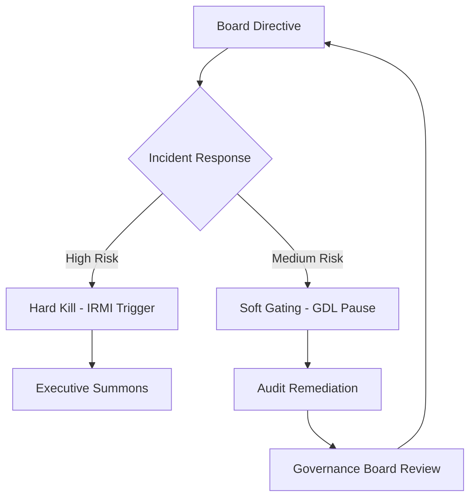

# Master AGI Governance & Strategic Communication Framework: G-SIB Edition
**Architect:** Jules (Principal Systems Architect & Governance Lead)
**Target Compliance:** EU AI Act (Title III, Art 15), SR 11-7, SR 11-7, NIST AI RMF 1.0, GDPR/FERPA

---

## 1. The 18-Component AGI/ASI Governance Model

### Strategic Pillar: Policy & Civilizational Alignment
1.  **AGI Alignment Policy:** Formalizing the target goal-vector $g(t)$ for all autonomous agents.
2.  **Algorithmic Liability Framework:** Legal protocols for M2M commerce and autonomous financial actions.
3.  **Institutional Readiness Maturity Index (IRMI):** Quantified metrics for organizational adaptation velocity.
4.  **Epistemic Humility Protocols:** Critical assessment of AI statistical confidence versus ground truth.
5.  **Strategic Decision-Making Under Deep Uncertainty:** Frameworks for navigating AI improvement velocity.
6.  **Symbiotic Workforce Transformation:** Transitioning human roles from Execution to Orchestration.

### Operational Pillar: Model Risk & Auditability
7.  **Regulatory Crosswalk:** Dynamic mapping between NIST RMF, EU AI Act, and SR 11-7.
8.  **Multi-agent Consensus:** Auditor-Agent swarms performing real-time consistency probing.
9.  **PII-free Immutable Logging:** GDPR Article 25 compliant source-hashing at the edge.
10. **Veridical RAG Implementation:** High-assurance retrieval requiring cryptographic provenance.
11. **Hyperparameter Governance:** Technical standards for documenting epochs, batch size, and learning rate.
12. **Differential Privacy Design:** FERPA/GDPR compliant Laplace mechanisms for sensitive cohorts.

### Technical Pillar: Substrate & Enforcement
13. **Compute Governance:** Real-time control and quota management of the hardware substrate.
14. **Hardware Kill-switch (IRMI):** Kernel-level `INT 0x1A` interrupts for GPU/VRAM purging.
15. **Deceptive Alignment Detection:** Activation-level probing for latent sycophancy or reward hacking.
16. **Deterministic Gating (GDL):** Formal language (GDL) for non-bypassable safety invariants.
17. **Machine Identity (SPIRE):** Zero-trust authentication using X.509 SVIDs for all agents.
18. **Recursive Context Envelopes (RCE):** Preservation of reasoning trace integrity across agent handoffs.

---

## 2. G-SIB Readiness Assessment & Maturity Rubric

| Component | L1: Initial | L3: Defined | L5: Optimized |
| :--- | :--- | :--- | :--- |
| **Kill-switch** | Manual process. | API-based shutdown. | Autonomous IRMI Hardware interrupt. |
| **Provenance** | Metadata based. | Signed data chunks. | Cryptographically verified Veridical RAG. |
| **Audit** | Human review. | Scripted analysis. | Auditor-Agent consensus swarms. |
| **Privacy** | Data masking. | Standard anonymity. | FERPA/GDPR Differential Privacy (DP). |

---

## 3. Executive Dashboard: "From EU Compliance to AGI Readiness"

### 3.1 G-SIB Liquidity & Risk Status (Unicode Sparklines)
*   **Algorithmic Bias Rate:** 0.04% [▃▅▇] (Target < 0.05%)
*   **Liquidity Risk Exposure:** High [▇▆▅] (Mitigation Active)
*   **Governance Control Effectiveness:** 94% [▆▇▇] (SR 11-7 Compliant)

### 3.2 Mermaid Escalation Flow

