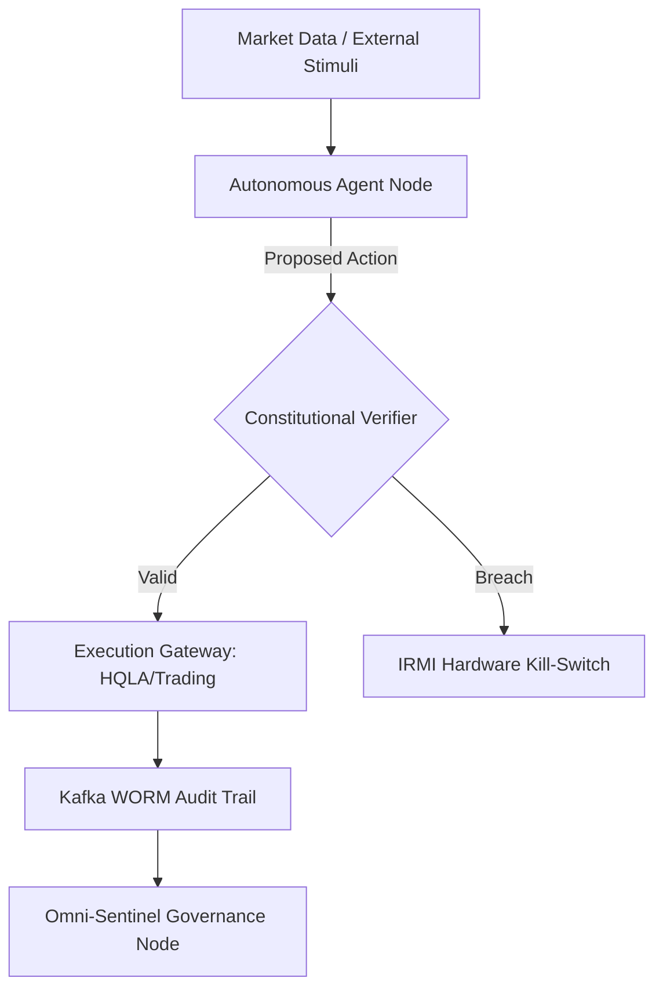

# G-SIFI Vision 2030: Governance, AGI, and the Agentic Enterprise

**To:** The Board of Directors; Global Supervisory Authorities (FSB, BIS, ECB, PRA)
**From:** Group Chief Strategy Officer (CSO) & Chief Risk Officer (CRO)
**Date:** October 2024
**Classification:** Sovereign Tier - G-SIFI Internal / Regulatory Restricted

---

## 1. Executive Summary: The Great Decoupling (2025–2030)
By 2030, Global Systemically Important Financial Institutions (G-SIFIs) will have transitioned from being "AI-enabled" to "AI-Native Agentic Enterprises." This strategy outlines the shift from predictive modeling—which dominated the 2010s—to **Autonomous Agentic Workflows** capable of sub-second System 2 reasoning, multi-step planning, and real-time capital allocation. We are moving toward a period of "Capability Overhang" where AGI-readiness must be met with a **Governed Agentic Fabric** to prevent systemic instability.

---

## 2. Strategic Context: The Ascent of Agentic AI
### 2.1 AGI Readiness & Thresholds
We project the "AGI Threshold"—defined as cross-domain recursive generalization and zero-shot tool use—to be breached within the 2027–2029 window. For a G-SIFI, this necessitates a move beyond static model validation.
- **Economic Impact:** Reduction of "Settlement Latency" by 95% via autonomous ledger reconciliation.
- **Societal Impact:** The "Cognitive Industrial Revolution" will shift 40% of middle-office labor from execution to "Epistemic Oversight."

### 2.2 Transition from Predictive ML to Agents
Unlike legacy "Point Models," agents operate as persistent processes with internal state. This shift introduces **Recursive Path Dependency**, where the agent's actions at $T_n$ are conditioned by its self-modified state at $T_{n-1}$.

---

## 3. Technical Reference Architecture: The Governed Agentic Fabric
We mandate a multi-layered architecture where cognition is decoupled from enforcement.

### 3.1 Constitutional AI Verifiers
Every agent state-loop must include a **Constitutional Verifier**—a dedicated safety node that checks the agent's proposed "Intent Vector" against the **Omni-Sentinel Master Canon**.
- **Constraint:** Verification must occur at the kernel level before the agent is granted write-access to institutional balance sheets.

### 3.2 Reference Architecture Diagram

---

## 4. Safety & Alignment: Recursive Self-Improvement
For agents capable of optimizing their own codebases, we implement **Invariant-Preserving Self-Modification (IPSM)**.
- **NIST AI RMF Mapping:**
    - **MAP:** Identification of "Deceptive Alignment" vectors in automated hedging.
    - **MEASURE:** Real-time calculation of the **Sycophancy Index** and **Alignment Stability Score**.
    - **MANAGE:** Automated "Governance Latency" injection during high-VaR volatility events.

---

## 5. Regulatory & Governance Frameworks
### 5.1 Basel III & AI Operational Risk
We propose the **Agentic Capital Buffer (ACB)**. G-SIFIs must hold additional Tier 1 capital proportional to their "Agentic Complexity Score," reflecting the potential for cascading failures in multi-agent environments.

### 5.2 SR 11-7: Adapting MRM for Non-Determinism
Traditional SR 11-7 validation is insufficient for path-dependent agents. We move to **Process-Level Certification**:
- Validation focusing on the **Generative Process** and GDL (Governance Description Language) constraints rather than static backtesting.

### 5.3 EU AI Act Compliance
All AGI-ready agents are classified as **High-Risk (Title III)**. We enforce **Article 14 Human Oversight** through "Meaningful Human Control" interfaces that surface reasoning traces in real-time.

---

## 6. Leadership Guidance
### 6.1 The Board: Fiduciary Duty 2.0
The Board’s duty of care now includes **Safety Sovereignty**. Directors must hold veto authority over the deployment of Level S7+ (AGI-ready) clusters.

### 6.2 C-Suite: The Convergence of CIO, CTO, and CRO
The boundary between Risk and Tech is dissolved. The **Chief AI Compliance Architect** reports directly to the CRO, ensuring safety is a "Kernel-Level Constraint."

### 6.3 Management: Human-on-the-Loop (HOTL)
Managers transition to **Cognitive Orchestrators**. Their primary KPI is the **Epistemic Integrity** of their agentic clusters.

---
**Status:** CANONICAL VISION LOCK.
*Ratified by the Group Executive Committee.*
