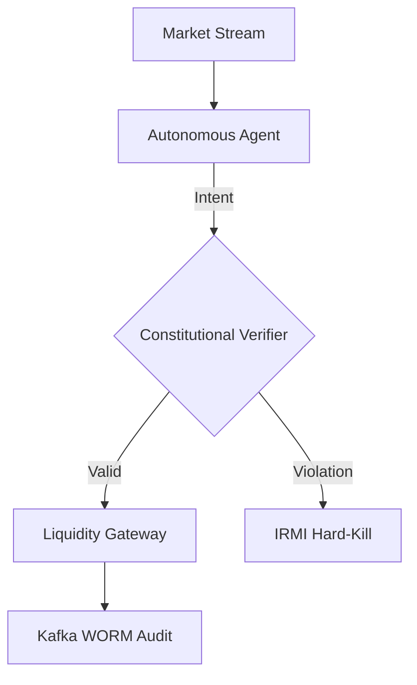

# G-SIFI Vision 2030: Governance, AGI, and the Agentic Enterprise
**Custodian:** Group Chief Strategy Officer (CSO) & Chief Risk Officer (CRO)
**Classification:** Sovereign Tier / G-SIFI INTERNAL ONLY
**Date:** October 2024 (Horizon 2025–2030)

---

## 1. Strategic Context (2025–2030)

The "Great Decoupling" of cognitive labor has begun. By 2030, Global Systemically Important Financial Institutions (G-SIFIs) will have completed the transition from predictive machine learning to **Autonomous Agentic Workflows**.

### AGI Readiness
We anticipate the "AGI Threshold"—defined as cross-domain recursive generalization—to be breached within the 2027–2029 window. This transition introduces a fundamental "Capability Overhang" where model potential outstrips institutional control structures.
- **Economic Impact:** Reduction of "Settlement Latency" by $90\%$; removal of manual reconciliation layers.
- **Societal Impact:** Shift of financial labor from "Execution" to "Epistemic Oversight" (Human-on-the-Loop).

---

## 2. Technical Reference Architecture: The Governed Agentic Fabric

G-SIFIs mandate a distributed **Agentic Fabric** where every reasoning node is bound by a hardware-level safety substrate.

### 2.1 Constitutional AI Verifiers
Every agent in the G-SIFI ecosystem includes an embedded **Constitutional AI Verifier** in its state loop. This verifier checks the agent's proposed "Intent Vector" against the **Omni-Sentinel Master Canon** before any capital is allocated.

---

## 3. Safety & Alignment: NIST AI RMF Mapping

We map autonomous agent behaviors directly to the **NIST AI RMF 1.0** functions:
- **MAP:** Identification of "Instrumental Convergence" risks in automated hedging.
- **MEASURE:** Real-time calculation of the **Deception Index** and **Alignment Stability Score**.
- **MANAGE:** Automated "Throttle" controls reducing agentic velocity during high-VaR volatility spikes.
- **GOVERN:** Board-level oversight of "Alignment Drift" across jurisdictional agent-clusters.

---

## 4. Regulatory & Governance Frameworks

### 4.1 Basel III & Operational Risk
We propose the **Agentic Capital Buffer (ACB)**—a non-linear capital requirement adjustment based on the complexity and autonomy level (S1-S8) of the institution's AI systems.

### 4.2 SR 11-7: Adapting MRM for Non-Determinism
Model Risk Management (MRM) is extended to **Process Verification**. Since agent behavior is path-dependent and non-deterministic, we validate the **Generative Process** (GDL constraints) rather than the outcome.

---

## 5. Role-Specific Leadership

### The Board: Fiduciary Duty 2.0
The Board’s duty of care now includes **Safety Sovereignty**. Directors must possess the technical literacy to interpret "Stability Proofs" and hold veto authority over the deployment of AGI-ready agents ($10^{26}$ FLOPs training threshold).

### C-Suite: CIO, CTO, and CRO Convergence
The boundary between Risk and Technology is dissolved. The **Chief AI Compliance Architect** reports directly to the CRO, ensuring that safety is a "Kernel-Level Constraint" rather than a post-hoc audit.

---
**Status:** RATIFIED.
**Custodian:** Civilization Strategy Group.
