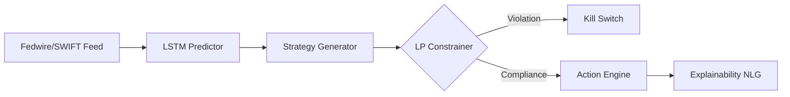

# LiquidGuard AI: Autonomous Liquidity Optimization Platform

## 1. Neuro-Symbolic Decision Framework
The platform integrates a **Transformer-based Strategy Generator** with a **Deterministic Linear Programming (LP) Solver**.

## 2. Integration Points
- **SWIFT gpi:** Real-time settlement tracking via REST/Webhooks.
- **SAP/Oracle ERP:** Intraday ledger synchronization via Kafka.
- **SR 11-7 Reporting:** NLG engine auto-generates trade rationales for auditors.
