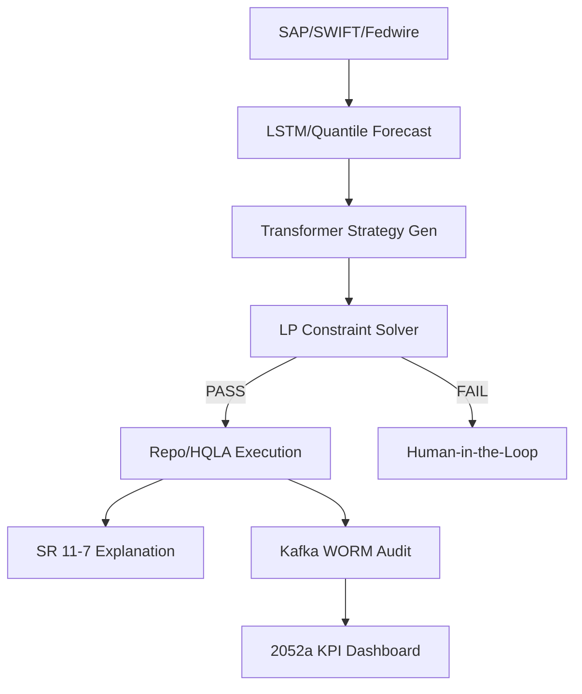

# Technical Specification: LiquidGuard AI
## Autonomous Liquidity Optimization Platform for G-SIFIs
**Custodian:** Chief Liquidity Architect & AI Governance Lead
**Regulatory Scope:** Basel III, SR 11-7, 2052a (5G)
**Status:** Canonical Implementation Spec v2.1

---

## 1. Liquidity Forecasting Engine (LFE)

The LFE utilizes a high-frequency ingestion layer to provide multi-horizon liquidity projections.

### 1.1 Data Integration & Pipeline
- **ERP Integration:** Native connectors for SAP S/4HANA and Oracle Cloud ERP for Intraday Ledger synchronization.
- **SWIFT gpi:** Real-time inbound/outbound payment tracking via ISO 20022 messaging.
- **Fedwire:** Direct socket integration for real-time settlement monitoring.

### 1.2 Model Architecture
- **Ensemble LSTM:** Captures non-linear temporal dependencies in daily cash flow cycles.
- **Quantile Regression:** Generates probabilistic risk intervals ($\tau = 0.05, 0.5, 0.95$) for liquidity stress scenarios.
- **Projection Horizons:**
    - **Intraday:** Minute-level resolution for clearing and settlement windows.
    - **Overnight:** T+1 funding requirement estimation.
    - **30-Day LCR:** Continuous projection of the Liquidity Coverage Ratio.

---

## 2. Neuro-Symbolic Decision Framework

The system decouples "Strategy Generation" from "Constraint Enforcement."

### 2.1 Architecture
- **Neural Component:** Transformer-based Strategy Generator trained on historical repo market dynamics and HQLA (High-Quality Liquid Asset) performance.
- **Symbolic Component:** Deterministic Linear Programming (LP) Solver (e.g., Gurobi/CPLEX) that enforces hard Basel III limits.

### 2.2 Decision Matrix
| Objective | Neural Action | Symbolic Constraint |
| :--- | :--- | :--- |
| **LCR Optimization** | Suggest HQLA rebalancing. | $LCR \geq 105\%$ (Hard Floor). |
| **Funding Cost** | Execute Repo Market bid. | Maximize $HQLA_{Level1}$ buffer. |
| **Operational Efficiency** | Automated Intraday sweep. | No overdraft on Fed account. |

### 2.3 NLG Explainability (SR 11-7)
Every trade is accompanied by a Natural Language Generation (NLG) rationale:
*"Action: Buy $200M UST Level 1. Rationale: PD increase in EMEA cluster detected; action maintains LCR at 108.2% vs 105% trigger."*

---

## 3. Compliance & Control: Circuit Breakers

### 3.1 Basel III / SR 11-7 Logic
- **Fail-Safe:** Logic triggers an immediate "Throttle" on automated transactions when LCR drops below 106%.
- **Hard Kill-Switch:** Total suspension of autonomous agency if LCR $< 105\%$ or if the Inherent Risk Mitigation Interface (IRMI) detects an exfiltration attempt.
- **HITL Escalation:** Mandatory manual sign-off for any individual transaction $>\$500M$ or cumulative daily drift $>\$2B$.

---

## 4. Model Drift Detection

### 4.1 Methodology
- **KS Test:** Continuous Kolmogorov-Smirnov (KS) testing between live prediction residuals and the validated training distribution.
- **Fallback:** If $p\text{-value} < 0.05$, the system automatically transitions to **"Shadow Mode."** Decisions are logged and sent to the Human-on-the-Loop but not executed.

---

## 5. KPI Monitoring Dashboard

- **Drift Latency:** Time delta between distribution shift and shadow mode activation.
- **Automated Decision Reversal Rate:** Frequency of human overrides on AI-suggested trades.
- **5G/2052a Readiness:** Real-time generation of the FR 2052a (5G) report for regulatory submission.

---

## 6. Economic Value Added (EVA) Methodology

We quantify the impact of LiquidGuard AI via:
$$\text{EVA Uplift} = (\text{Buffer Reduction} \times \text{ROA}) - \text{Operational AI Cost}$$
- **Capital Optimization:** Reducing "Idle Cash" buffers from $115\%$ to $107\%$ creates an estimated annual benefit of $85\text{bps}$ on RWA (Risk-Weighted Assets).

---

## 7. Architecture Diagram (Mermaid)

---
**Signed,**
Chief Liquidity Architect
Apex Global Financial Group
