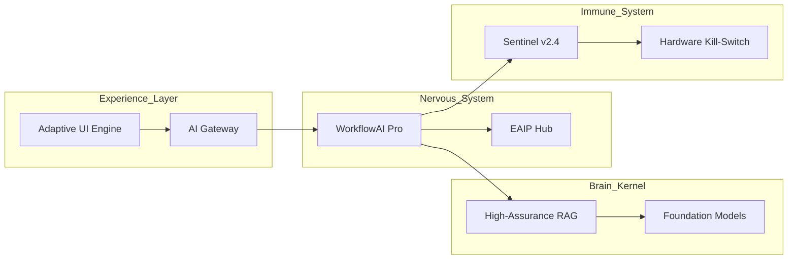

# Master Blueprint: Enterprise AI-OS & 100-Component Reference Architecture
**Target:** Global 2000 Enterprises
**Timeline:** 2026 - 2030
**Standards:** ISO 42001, NIST AI RMF, EU AI Act, GDPR, SEC Rule 17a-4

---

## 1. The Enterprise AI-OS: Mega Blueprint
The AI-OS is a unified orchestration layer that integrates reasoning, memory, governance, and execution.

### 1.1 Core Integration Layers
- **Orchestration Layer:** WorkflowAI Pro (Stateful execution, retry logic, tool-calling).
- **Governance Layer:** Sentinel Platform v2.4 (GDL enforcement, mTLS gating, audit anchoring).
- **Interoperability Layer:** EAIP (Agent-to-agent communication, capability discovery).
- **Intelligence Layer:** High-Assurance RAG (Vector Stores, Graph DBs, Epistemic Verification).

---

## 2. 100-Component Reference Architecture Matrix
*Categorized by domain capability.*

### I. Governance & Compliance (20)
1. GDL Compiler | 2. OPA Rego Gating | 3. GDPR Residency Controller | 4. PII Redactor Sidecar | 5. SEC 17a-4 WORM Log | 6. SR 11-7 Model Inventory | 7. Ethical Bias Monitor | 8. Human-in-the-Loop Gateway | 9. Explainability (XAI) Engine | 10. Adversarial Red-Team Agent | 11. Data Lineage Tracker | 12. Policy-as-Code Sync | 13. Audit Trace Merkle-Rooter | 14. Compliance Heatmap | 15. Risk Appetite Dashboard | 16. Finma/Bafin Gatekeeper | 17. ANSM Regulatory Sidecar | 18. Bias Mitigation Kernel | 19. Hallucination Scorer | 20. Token-to-Dollar Monitor.

### II. Identity & Security (20)
21. SPIFFE/SPIRE SVID Hub | 22. mTLS Service Mesh | 23. HSM-Backed Payloads | 24. Zero-Trust Access Proxy | 25. eBPF Threat Hunter | 26. Runtime Workload Attestation | 27. Prompt Injection Shield | 28. Data Hashing (Salted SHA-256) | 29. Key Management Service (KMS) | 30. OAuth2/OIDC Broker | 31. Air-Gap Swarm Controller | 32. VPN/Private Link Bridge | 33. Intrusion Detection (IDS) | 34. SIEM Integration | 35. SSO Identity Provider | 36. Credential Vault | 37. Endpoint Protection | 38. Network Segmentation | 39. Anomaly Detection Engine | 40. Secure Boot / TPM.

### III. Orchestration & Intelligence (20)
41. WorkflowAI Pro Engine | 42. EAIP Capability Discovery | 43. ReAct Reasoning Loop | 44. Chain-of-Thought Trace | 45. Multi-Agent Task Broker | 46. Tool-Calling Sandbox | 47. Vector DB (Pinecone/pgvector) | 48. Graph DB (Neo4j/ArangoDB) | 49. Semantic Cache (Redis) | 50. Inference Server (vLLM/TGI) | 51. Model Quantizer | 52. LoRA Adapter Registry | 53. Fine-Tuning Pipeline | 54. Embedding Service | 55. Reranking Kernel | 56. PDF/OCR Ingestion | 57. Heterogeneous GNN | 58. Recommendation Engine | 59. Sentiment Analyzer | 60. Intent Classifier.

### IV. Data & Memory (20)
61. Kafka Event Bus | 62. Schema Registry | 63. Dead Letter Queue | 64. Postgres Relational DB | 65. S3-Compatible Storage | 66. Data Lakehouse | 67. ETL/ELT Pipeline | 68. Metadata Catalog | 69. Feature Store | 70. Time-Series DB (Influx/Timescale) | 71. Cache Invalidator | 72. Data Consistency Manager | 73. Replication Controller | 74. Backup/Recovery Hub | 75. Data Masking Engine | 76. Data Quality Monitor | 77. Semantic Router | 78. Chunking Strategy Lib | 79. Knowledge Graph Mapper | 80. Recursive Context Envelope.

### V. Infrastructure & DevOps (20)
81. Kubernetes (EKS/AKS/OpenShift) | 82. Docker Swarm (Air-Gap) | 83. Terraform/IaC | 84. CI/CD (GitLab/Jenkins) | 85. Monitoring (Prometheus/Grafana) | 86. Distributed Tracing (Jaeger) | 87. Log Aggregator (ELK/Loki) | 88. HPA (Autoscaling) | 89. GPU Resource Manager | 90. Cost Allocation API | 91. Service Discovery | 92. Load Balancer | 93. CDN/Edge Caching | 94. Registry (Docker/Harbor) | 95. Vulnerability Scanner | 96. Chaos Engineering Tool | 97. GitOps Controller | 98. Secrets Operator | 99. Performance Benchmarker | 100. Site Reliability Dashboard.

---

## 3. Implementation Guidance: Self-Multiplying Systems
For autonomous agents that spawn sub-agents (Self-Multiplying):
1. **Ancestry Headers:** Every sub-agent MUST inherit the SPIFFE SVID of its parent with a "Child-Nonce."
2. **Recursive Budgeting:** The parent agent delegates a subset of its "Token/Cost Budget." Once exhausted, the sub-agent is hard-terminated.
3. **GDL Propagation:** Policy invariants are recursively enforced down the tree. A violation at any leaf trips the root circuit breaker.
