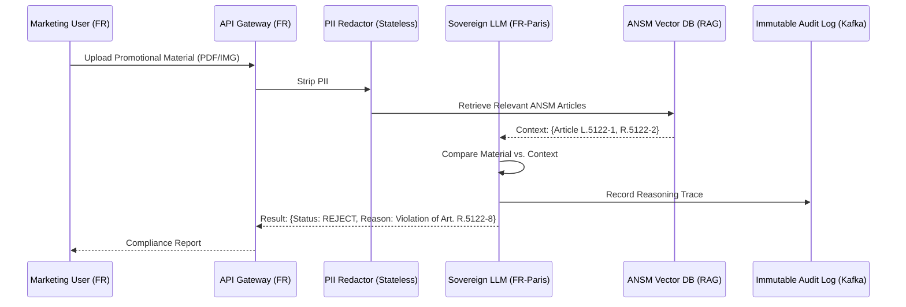

# AI Governance Analysis: PharmaGuard Marketing Compliance Reviewer
**Directive:** "Implement a Generative AI Marketing Compliance Reviewer for a French Pharmaceutical Company. The system must check promotional materials against ANSM regulations and GDPR. All data processing must occur within France."

---

## 1. Executive Summary
The proposed "PharmaGuard" system is highly actionable and strategically aligned with the **EU AI Act (High-Risk Category)** and **ANSM (French National Agency for the Safety of Medicines and Health Products)** transparency mandates. The project is technically feasible using **Sovereign RAG (Retrieval-Augmented Generation)** architectures hosted on SecNumCloud-certified infrastructure in the FR-Paris region. This implementation addresses the high-velocity compliance overhead in the French pharmaceutical sector while ensuring absolute data residency and GDPR compliance.

---

## 2. Risk & Compliance Matrix

| Risk Vector | NIST RMF Function | ISO 42001 Control | Compliance Clause | Mitigation |
| :--- | :--- | :--- | :--- | :--- |
| **Data Residency** | GOVERN-1.2 | A.8.4 (Sovereignty) | GDPR Art. 3; BDSG/BDSG-equivalent | Deployment on local French CSP (OVHcloud/Orange) with FR-only routing. |
| **Regulatory Drift** | MEASURE-2.1 | A.10.2 (Monitoring) | ANSM Public Health Code | Weekly ingestion of ANSM circulars into the Vector Store. |
| **Opaque Reasoning** | MANAGE-4.3 | A.8.2 (Transparency) | EU AI Act Art. 13 | Mandatory citation of the specific ANSM article for every rejection. |
| **Bias in Review** | MAP-3.1 | A.9.1 (Assessment) | Ethical Guidelines | Counter-factual testing on diverse marketing personas (Pediatric/Geriatric). |

---

## 3. Governance RACI Matrix

| Role | Business Owner (Marketing) | Compliance Officer (ANSM Expert) | Data Scientist | Data Protection Officer (DPO) |
| :--- | :---: | :---: | :---: | :---: |
| **Policy Definition** | C | A | I | R |
| **Model Gating/OPA** | I | R | R | C |
| **System Instruction (RAG)** | C | A | R | I |
| **DPIA Approval** | I | I | I | A |

*R=Responsible, A=Accountable, C=Consulted, I=Informed*

---

## 4. Technical Requirements
- **Compute:** Localized H100/A100 clusters in FR-Paris. No cross-border inference (e.g., Azure West US).
- **Latency:** < 1.5s for initial screening; < 10s for deep regulatory analysis.
- **Privacy Sidecar:** Stateless PII redaction (removing patient names/doctor IDs) before inference.
- **Sovereignty:** **SecNumCloud** (ANSSI) certification for the hosting layer.

---

## 5. Architecture Diagram: Sovereign Compliance Flow

---

## 6. Implementation Artifacts
1.  **DPIA (Data Protection Impact Assessment):** Focusing on French-specific GDPR interpretations.
2.  **Model Card (v1.0):** Detailing the "Regulatory Density" of the training/fine-tuning set.
3.  **System Constitution:** Immutable instructions preventing the AI from generating medicinal advice.
4.  **ANSM Knowledge Base:** Curated, versioned repository of French pharmaceutical law.

---
**Lead Architect:** [REDACTED]
**Status:** PATH A - ACTIONABLE
