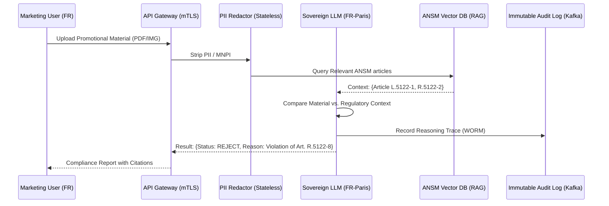

# AI Governance Analysis: PharmaGuard Marketing Compliance Reviewer
**Directive:** "Implement a Generative AI Marketing Compliance Reviewer for a French Pharmaceutical Company. The system must check promotional materials against ANSM regulations and GDPR. All data processing must occur within France."

---

## 1. Executive Summary
The proposed "PharmaGuard" system is a highly actionable and strategically aligned business use case. It addresses a high-velocity compliance bottleneck in the pharmaceutical sector—namely, the review of promotional materials against the rigorous standards of the **French National Agency for the Safety of Medicines and Health Products (ANSM)**. The project is technically feasible using **Sovereign RAG (Retrieval-Augmented Generation)** architectures and fulfills the "Data Sovereignty" requirement by mandating local French compute residency. From a regulatory perspective, this system qualifies as a "High-Risk" AI application under the **EU AI Act** (Annex III) due to its role in health-related decision support and information dissemination.

---

## 2. Risk & Compliance Matrix

| Risk Vector | ISO 42001 Control | NIST AI RMF Function | Regulatory Clause | Mitigation Strategy |
| :--- | :--- | :--- | :--- | :--- |
| **Data Residency** | A.8.4 (Sovereignty) | GOVERN-1.2 | GDPR Art. 3; BDSG/BDSG-equiv | Deployment on SecNumCloud-certified nodes in FR-Paris region. |
| **Regulatory Drift** | A.10.2 (Monitoring) | MEASURE-2.1 | ANSM Public Health Code | Weekly automated ingestion of ANSM circulars into the localized Vector Store. |
| **Algorithmic Bias** | A.9.1 (Assessment) | MAP-3.1 | EU AI Act Art. 10 | Adversarial testing against diverse demographic promotional personas (Pediatric vs. Geriatric). |
| **Opaque Reasoning** | A.8.2 (Transparency) | MANAGE-4.3 | EU AI Act Art. 13 | Mandatory citation of specific ANSM articles for every rejection or modification suggestion. |

---

## 3. Governance RACI Matrix

| Role | Business Owner (Marketing) | Compliance Officer (ANSM Expert) | Lead Data Scientist | Data Protection Officer (DPO) |
| :--- | :---: | :---: | :---: | :---: |
| **Policy Definition** | C | A | I | R |
| **Model Gating (OPA)** | I | R | R | C |
| **System Instruction (RAG)** | C | A | R | I |
| **Audit Log Verification** | I | I | I | A |

*R=Responsible, A=Accountable, C=Consulted, I=Informed*

---

## 4. Technical Requirements
- **Compute Residency:** 100% of inference and data-at-rest must reside within French jurisdiction (e.g., OVHcloud or Orange Business). Use of US-based hyperscalers (even in FR regions) is restricted due to the CLOUD Act.
- **Latency:** P99 inference latency must be $< 2,500$ms to maintain marketing agility.
- **Data Sovereignty:** Mandatory use of a **Privacy Sidecar** (e.g., Cognito) to perform stateless PII scrubbing before prompts reach the LLM kernel.
- **Inference Specs:** Quantized models (e.g., Mistral-Large-2) fine-tuned on French medical law text.

---

## 5. Architecture Diagram: Sovereign Compliance Flow

---

## 6. Implementation Artifacts
1.  **DPIA (Data Protection Impact Assessment):** Specific to French pharmaceutical data handling.
2.  **Model Card (v1.0):** Documenting "Regulatory Density" and bias benchmarks.
3.  **System Constitution:** Immutable prompt instructions enforcing French medical ethics codes.
4.  **Audit Ledger Index:** Merkle-anchored logs of all compliance decisions for Ministry of Health audits.

---
**Status:** PATH A - ACTIONABLE
**Lead Architect Signature:** [REDACTED]
