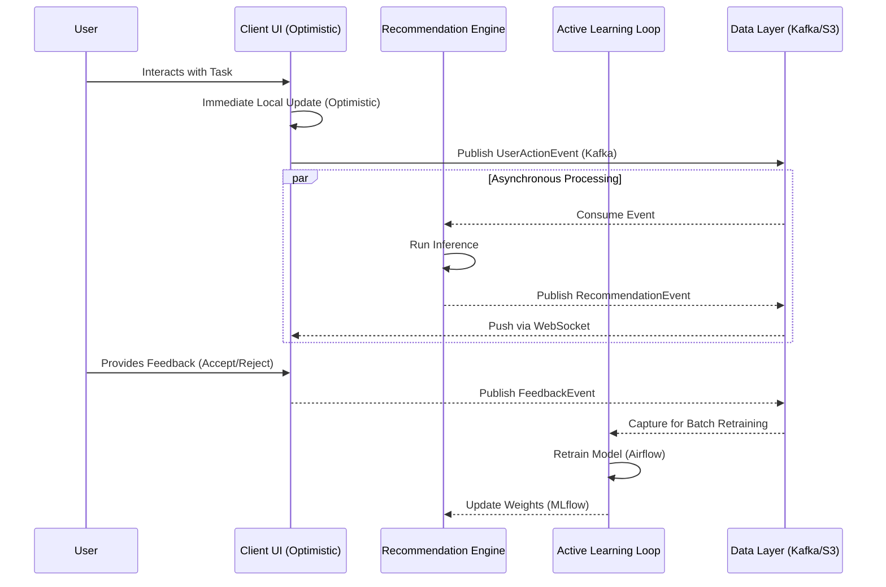

# Scalable Productivity Platform: Event-Driven Architecture Specification

**Author:** Senior Software Architect
**Status:** Draft v1.0
**Pattern:** Event-Driven Microservices

## Executive Summary
This architecture defines a high-performance, inclusive productivity platform built on an asynchronous, event-driven backbone. By decoupling the AI inference, active learning, and accessibility layers, we ensure high scalability, low latency, and a resilient user experience.

---

## 1. AI-Driven Workflow Recommendation Engine

### Technical Architecture
- **Core Responsibilities:** Analyzes user behavior patterns to suggest optimal task sequences and automate routine workflows.
- **Data I/O:** Receives a stream of `UserActionEvent` via Kafka; outputs `WorkflowRecommendationEvent`.
- **Tech Stack:**
  - **Inference:** Python (FastAPI/PyTorch) served via Kubernetes.
  - **Messaging:** Apache Kafka for high-throughput event streaming.
  - **Vector Storage:** Pinecone/Weaviate for embedding-based similarity search of workflow patterns.
- **Database:** PostgreSQL (for relational user metadata) + Vector DB.
- **Privacy:** Data anonymization at the ingest layer; PII redaction before embedding generation.

### UX & Inclusivity
- **Adaptive UX:** Suggestions are surfaced non-intrusively (e.g., "Would you like to automate this?").
- **Accessibility:** Voice-command integration for workflow execution; high-contrast visual cues for recommendations.

### Interface Design
- **Endpoints:**
  - `GET /recommendations/active`: Retrieve current suggested workflows.
  - `POST /recommendations/feedback`: Submit user acceptance/rejection of a suggestion.
- **Event Topics:**
  - `workflow.events.raw`: Raw user interaction events.
  - `workflow.recommendations.generated`: Published recommendations for the UI.

---

## 2. Accessibility Enhancement Layer (AEL)

### Technical Architecture
- **Core Responsibilities:** Transforms UI components and content in real-time to meet WCAG 2.1 AA+ standards based on user profiles.
- **Data I/O:** Intercepts `ContentState`; applies transformations; emits `AccessibleContentState`.
- **Tech Stack:** Node.js (TypeScript), AWS Lambda (Edge), CSS-in-JS (for dynamic theming).
- **Intersection with AI:** Uses the **Adaptive Content System** to translate visual data into descriptive ARIA labels or audio-tactile feedback.

### UX & Inclusivity
- **Dynamic Theming:** Real-time adjustment of contrast, font size, and spacing without page reload.
- **Screen Reader Optimization:** AI-generated alt-text for dynamic charts and complex layouts.

### Interface Design
- **Endpoints:**
  - `GET /accessibility/profile`: Fetch user-specific accessibility preferences.
  - `PATCH /accessibility/settings`: Update preference (e.g., "Motion Reduced: true").
- **Event Topics:**
  - `ui.accessibility.update`: Broadcasts preference changes to all frontend instances.

---

## 3. Active Learning Loop (ALL)

### Technical Architecture
- **Core Responsibilities:** Captures user feedback on AI suggestions to retrain models and improve recommendation accuracy.
- **Data I/O:** Consumes `FeedbackEvent`; batches for retraining; triggers `ModelUpdateEvent`.
- **Tech Stack:** Airflow (Orchestration), Spark (Batch processing), MLflow (Model tracking).
- **Justification:** Decoupling retraining from live inference prevents performance degradation during heavy compute cycles.

### UX & Inclusivity
- **Transparency:** "Why am I seeing this?" tooltips that explain the AI's logic, improving trust and providing a correction mechanism.

### Interface Design
- **Endpoints:**
  - `GET /all/history`: Audit log of how the user's feedback has shaped their local model.
- **Event Topics:**
  - `all.feedback.captured`: High-frequency feedback stream.
  - `all.model.updated`: Notifies the Recommendation Engine to refresh its local weights.

---

## 4. Adaptive Content System (ACS)

### Technical Architecture
- **Core Responsibilities:** Dynamically reshapes content layouts based on device type, user cognitive load, and accessibility needs.
- **Data I/O:** `ContentObject` input -> `ContextualLayout` output.
- **Tech Stack:** React (Frontend), GraphQL (BFF - Backend for Frontend), Redis (Context caching).

### UX & Inclusivity
- **Cognitive Load Management:** Simplifies UI when high stress or multitasking is detected (via the ALL's telemetry).

### Interface Design
- **Endpoints:**
  - `POST /graphql/content`: Query for context-aware content fragments.
- **Event Topics:**
  - `content.layout.change`: Triggered when a device or context shift occurs.

---

## 5. Latency Mitigation Strategy

To prevent AI inference and learning loops from blocking user interaction:

1. **Optimistic UI:** The frontend updates state immediately upon user action (e.g., checking a task), while the `UserActionEvent` is processed asynchronously in the background.
2. **WebSockets (Socket.io/AWS AppSync):** Real-time recommendations and AEL updates are pushed from the server to the client, avoiding the latency of polling.
3. **Edge Computing (Cloudflare Workers/Lambda@Edge):** The **Accessibility Enhancement Layer** transformations are computed at the edge, closer to the user, reducing the round-trip time for layout adjustments.
4. **Non-Blocking Inference:** Recommendation requests are treated as "Fire and Forget" or "Future" patterns. The UI renders placeholders or default views until the `workflow.recommendations.generated` event arrives via the WebSocket.

---

## 6. Asynchronous Data Flow & Feedback Loop

