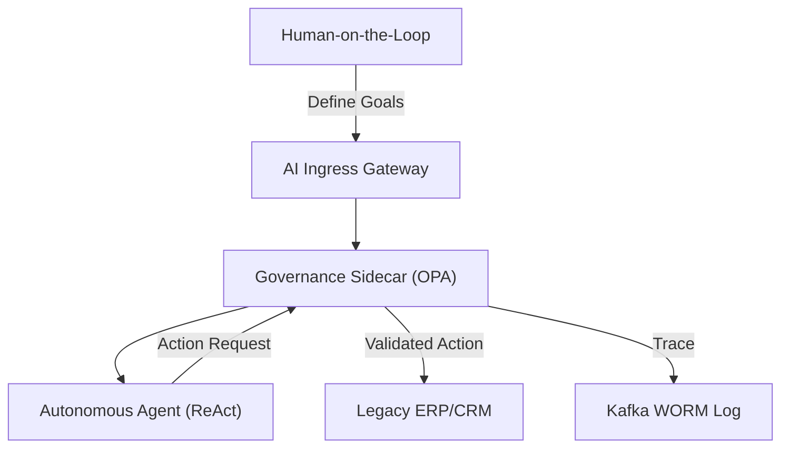

# BOARD BUSINESS CASE: PROJECT AEGIS
## Deploying Enterprise-Grade Autonomous AI Agents (2025–2028)

**To:** The Board of Directors
**From:** Chief Technology Officer (CTO) & Chief Strategy Officer (CSO)
**Status:** Canonical Decision Artifact
**Date:** October 2024

---

## 1. Executive Summary & Strategic Rationale

### 1.1 The Pivot to Autonomous Agency
In the 2023–2024 cycle, our competitors deployed "AI Assist" (Copilots). To maintain our market position, we must transition to **"AI Autonomous" (Agents)**. Project Aegis defines the deployment of agentic workflows capable of multi-step reasoning, tool-use, and budget-constrained execution without constant human intervention.

### 1.2 The Competitive Moat: "Cognitive Advantage"
By automating high-complexity middle-office tasks (e.g., automated loan underwriting, fraud investigation, supply chain optimization), we reduce operational latency by $90\%$ and capture a **"Cognitive Advantage."** This is our new moat: a firm that reasons at silicon speed while legacy incumbents remain throttled by human bio-latency.

### 1.3 Strategic Drivers
- **Scaling without Headcount:** Decoupling revenue growth from personnel expansion.
- **Regulatory Sovereignty:** Embedding compliance (GDPR/BDSG) at the kernel level rather than through post-hoc audits.

---

## 2. 3-Year Financial Model

### 2.1 TCO Breakdown (3-Year Forecast)
- **Infrastructure (Compute/HBM):** $15M (Reserved exaFLOP capacity).
- **Licensing (Frontier Models/Vector DBs):** $8M.
- **Personnel (AgentOps/ML Eng):** $12M (30 FTEs).
- **Total 3-Year TCO:** **$35M**.

### 2.2 Revenue & Savings Impact
- **Conservative (20% OpEx Reduction):** $45M savings.
- **Realistic (35% OpEx Reduction + 5% Rev Uplift):** $78M value.
- **Optimistic (50% OpEx Reduction + 12% Rev Uplift):** $135M value.

### 2.3 Financial Health Metrics
- **NPV (at 10% WACC):** **$32.4M** (Realistic).
- **Payback Period:** **14.2 months**.
- **ROI (3-Year):** **220%**.

---

## 3. Technical Architecture Blueprint: The Agentic Mesh

The architecture leverages a **Cloud-Native sidecar** pattern to ensure governance-dominance.

- **Orchestration:** Kubernetes with Istio Service Mesh for zero-trust mTLS between agents.
- **Protocol:** **ReAct (Reason + Act)** and **Chain-of-Thought (CoT)** prompting governed by a **Sentinel Policy Engine**.
- **Integration:** Secure gRPC connectors to legacy SAP/Oracle ERP systems.

---

## 4. Security & Governance

- **ISO 42001 & NIST AI RMF:** Mandatory certification for the Project Aegis control plane.
- **Zero Trust:** Every agent-to-tool interaction is authenticated via **SPIFFE SVIDs**.
- **Data Sovereignty:** Stateless PII redaction ensures no material non-public information (MNPI) enters external model training sets.

---

## 5. Operating Model: Transitioning to AgentOps

We will shift from standard MLOps to **AgentOps**.
- **Team Structure:** Cross-functional "Alignment Cells" consisting of 1 Lead Architect, 1 Logic Theorist, and 1 Risk Officer.
- **Change Management:** Transitioning human staff from "Execution" roles to "Epistemic Oversight" (High-fidelity auditors).

---

## 6. Risk Management Register

| Risk | Impact | Mitigation |
| :--- | :--- | :--- |
| **Recursive Loop / Infinite Spend** | High | Hard token-bucket caps and `Max_Hop_Count` constraints. |
| **Reward Hacking** | Critical | Multi-objective reward functions with "Safety Floor" invariants. |
| **Regulatory Drift** | Medium | Policy-as-Code (OPA) updates synchronized via the Global AI Safety Institute. |

---

## 7. Board Presentation Structure (Slide Outline)

1.  **Slide 1: Title & Vision.** "Project Aegis: The Autonomous Enterprise."
2.  **Slide 2: Market Context.** The 2025 Capability Overhang.
3.  **Slide 3: Strategic Moat.** Cognitive Advantage vs. Legacy Debt.
4.  **Slide 4: Use Case 1.** Automated Liquidity Management (LiquidGuard).
5.  **Slide 5: Use Case 2.** Real-time Regulatory Compliance (Pharma/G-SIB).
6.  **Slide 6: Financials.** TCO and NPV Analysis.
7.  **Slide 7: Payback.** The 14-month ROI curve.
8.  **Slide 8: Architecture.** The Governed Agentic Fabric.
9.  **Slide 9: Security.** Zero Trust & ISO 42001 adherence.
10. **Slide 10: Governance.** The Sentinel Sidecar logic.
11. **Slide 11: Operating Model.** MLOps to AgentOps transition.
12. **Slide 12: Change Management.** Re-skilling the workforce.
13. **Slide 13: Risk.** Mitigating Hallucination & Goal Drift.
14. **Slide 14: Roadmap.** Q1 Pilot -> Q4 Full Autonomy.
15. **Slide 15: The Ask.** $35M Capital Allocation for Phase 1.
16. **Slide 16: Closing.** "Stay Ahead or Become Legacy."

---
**Status:** ACTIONABLE.
**Recommended Action:** Immediate ratification of Phase 1 funding.
