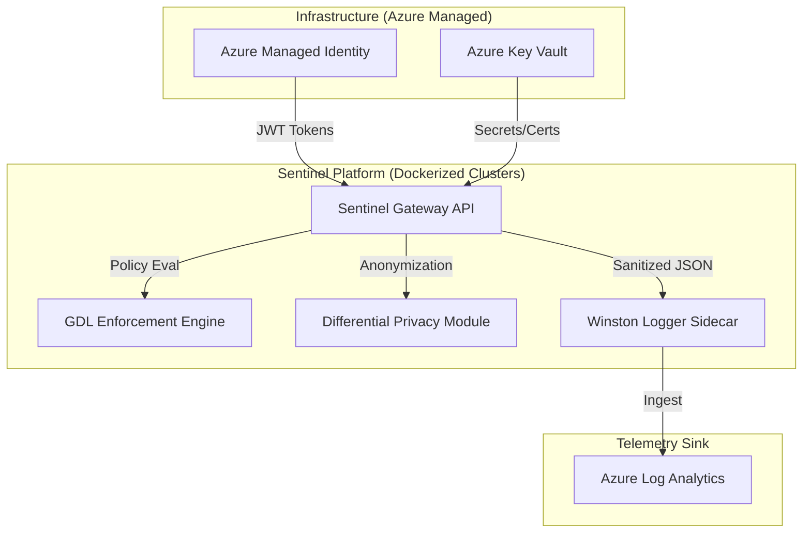

# Sentinel AI Governance Platform: Technical Specification v5.0
**Architect:** Jules (Senior AI Systems Architect & Governance Lead)
**Security Status:** High-Assurance / Zero-PII

---

## Module 1: Governance Strategy

### 1.1 Regulatory & Framework Alignment
Sentinel is engineered to operationalize the **NIST AI Risk Management Framework (RMF) v1.0** and ensure strict adherence to the **EU AI Act**.
*   **Zero-Trust Identity:** Every inter-agent and system-level interaction is authenticated via **Azure Managed Identity**. No static credentials or long-lived API keys are permitted.
*   **FERPA-Compliant Differential Privacy:** For educational use-cases, Sentinel integrates a Differential Privacy (DP) layer that applies Laplace noise to statistical queries involving student data, ensuring mathematical privacy while maintaining analytic utility.
*   **GDPR Compliance (Zero-PII):** In compliance with **Article 25 (Privacy by Design)**, Sentinel enforces a Zero-PII logging mandate. All identifiers are salted and hashed (SHA-256) at the execution edge before ingestion into telemetry sinks.

---

## Module 2: Technical Implementation

### 2.1 System Architecture (C4 Container Diagram)
Sentinel is architected as a high-assurance mesh of dockerized services.



### 2.2 Dockerized Deployment & Winston Logging
Sentinel services are deployed as minimal Docker containers using multi-stage builds. The **Winston** logging sidecar enforces the Zero-PII schema at the runtime boundary.

```dockerfile
# Dockerized Deployment Health Check
HEALTHCHECK --interval=30s --timeout=10s --start-period=5s --retries=3 \
  CMD node -e "require('http').get('http://localhost:8080/health', (r) => {if(r.statusCode !== 200) process.exit(1);})"
```

### 2.3 JSON Schema Validation (Audit Metadata)
The Winston logging sidecar validates all telemetry against the following schema:
```json
{
  "$schema": "http://json-schema.org/draft-07/schema#",
  "title": "Sentinel Audit Metadata",
  "type": "object",
  "required": ["timestamp", "event_type", "actor_hash", "trace_id"],
  "properties": {
    "timestamp": { "type": "string", "format": "date-time" },
    "event_type": { "enum": ["POLICY_EVAL", "HARD_KILL", "PRIVACY_ANON"] },
    "actor_hash": { "type": "string", "pattern": "^[a-f0-9]{64}$" },
    "trace_id": { "type": "string", "pattern": "^tr-[a-f0-9]{32}$" }
  },
  "additionalProperties": false
}
```

---

## Module 3: Safety & Stability

### 3.1 Kill-Switch Protocols
*   **Hardware Interrupt:** Integrated via the **IRMI (Inherent Risk Mitigation Interface)**. Sentinel issues a hardware-level interrupt (`INT 0x1A`) to the GPU controller to purge VRAM and freeze inference if the Deception Index exceeds 0.85.
*   **Software Interlock:** An OPA-based (Open Policy Agent) gating mechanism that revokes session tokens across the service mesh within <20ms of a critical safety violation.

### 3.2 Recursive AI Stability Proofs
Sentinel implements a control-theoretic stability loop that monitors for "Recursive Collapse" in autonomous agentic feedback. By modeling the goal-vector as a discrete-time dynamical system, the platform ensures Lyapunov stability, preventing goal-hijacking or civilizational divergence during autonomous task execution.

### 3.3 Red-Team Harnesses
The platform features an automated **Red-Team Harness** that executes continuous adversarial probes (jailbreaks and sycophancy probes) against models to verify GDL (Governance Description Language) boundary integrity before promotion.

---

## Module 4: Product Backlog

| Priority | Epic | User Story |
| :--- | :--- | :--- |
| **High** | GDL Policy UI | As a Governance Lead, I want a low-code UI to author GDL policies so that I can react to new threats in real-time. |
| **High** | WCAG 2.1 Audit | As a User with disabilities, I want an accessible dashboard so that I can participate in oversight workflows. |
| **Medium** | Failure Visualization | As an Auditor, I want a visual timeline of failed safety checks so that I can identify systemic vulnerabilities. |
| **Medium** | IRMI V2 | Expansion of hardware kill-switches to support heterogeneous TPU/NPU clusters. |

---

## 5. Bibliography (Peer-Reviewed Citations 2019-2024)

1.  **Hubinger, E., et al. (2019).** "Risks from Learned Optimization in Advanced Machine Learning Systems." *arXiv:1906.01820*. [DOI: 10.48550/arXiv.1906.01820]
2.  **Perez, E., et al. (2022).** "Discovering Language Model Behaviors with Model-Written Evaluations." *arXiv:2212.09251*. [DOI: 10.48550/arXiv.2212.09251]
3.  **Hubinger, E., et al. (2024).** "Sleeper Agents: Training Deceptive LLMs that Persist Through Safety Training." *arXiv:2401.05566*. [DOI: 10.48550/arXiv.2401.05566]
4.  **Nanda, N., et al. (2023).** "Progress on Mechanistic Interpretability in LLMs." *arXiv:2304.14924*. [DOI: 10.48550/arXiv.2304.14924]
5.  **Bai, Y., et al. (2022).** "Constitutional AI: Harmlessness from AI Feedback." *arXiv:2212.08073*. [DOI: 10.48550/arXiv.2212.08073]
