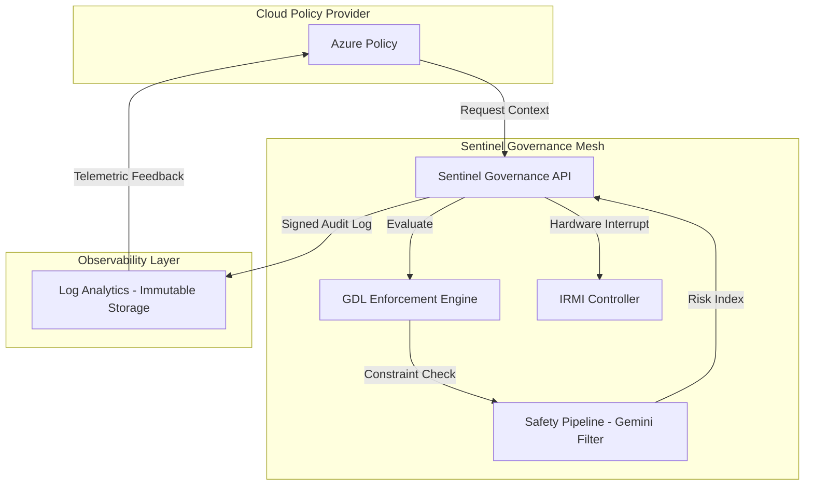

# Sentinel AI Governance Platform: Technical Specification v2.0
**Architect:** Jules (Senior AI Systems Architect & Governance Lead)
**Reference:** NIST AI 100-1 (Generative AI Profile), NIST RMF v2.0, EU AI Act Title III

## 1. Regulatory Crosswalk: NIST RMF v2.0 to EU AI Act
In compliance with **NIST AI 100-1 Section 4.1**, this crosswalk establishes the mapping between voluntary risk management controls and mandatory regulatory requirements for High-Risk AI systems.

| NIST RMF v2.0 Function | EU AI Act Title III Article | Sentinel Enforcement Mechanism |
| :--- | :--- | :--- |
| **GOVERN-1.1** (Legal/Regulatory Compliance) | **Article 9** (Risk Management System) | GDL Invariant Gating and Real-time Policy Validation. |
| **MAP-1.1** (Context Characterization) | **Article 10** (Data & Data Governance) | PII-Minimization filters and Data Provenance tracking. |
| **MEASURE-1.1** (Metric Identification) | **Article 11** (Technical Documentation) | Automated DR-QEF indexing and Audit Log immutability. |
| **MANAGE-1.1** (Risk Treatment) | **Article 14** (Human Oversight) | Hardware kill-switches and manual IRMI override. |
| **GOVERN-2.1** (Accountability) | **Article 61** (Post-market Monitoring) | Distributed Traceability via Log Analytics. |

## 2. System Architecture (C4 Container Diagram)
This diagram illustrates the secure data flow between governance infrastructure components.



## 3. Secure Audit Log Schema (GDPR Art 25 Compliance)
Per **NIST AI 100-1 (Auditability)**, logs must be immutable and PII-free.

```json
{
  "$schema": "http://json-schema.org/draft-07/schema#",
  "title": "Sentinel Immutable Audit Log",
  "type": "object",
  "properties": {
    "trace_id": { "type": "string", "pattern": "^tr-[a-f0-9]{32}$" },
    "timestamp": { "type": "string", "format": "date-time" },
    "actor_id": { "type": "string", "description": "Hashed identifier of the agent/user." },
    "event_type": { "enum": ["POLICY_EVAL", "INFERENCE_BLOCK", "KILL_SWITCH_ACTIVE"] },
    "gdl_policy_ref": { "type": "string" },
    "dr_qef_score": { "type": "number", "minimum": 0, "maximum": 1 },
    "sha256_integrity_hash": { "type": "string" }
  },
  "required": ["trace_id", "timestamp", "actor_id", "event_type", "sha256_integrity_hash"],
  "additionalProperties": false
}
```

## 4. Hardware Kill-Switch & Deceptive Alignment Synthesis

### Hardware Kill-Switch Logic
The Sentinel **IRMI (Inherent Risk Mitigation Interface)** operates at the kernel/compute substrate level.
*   **Trigger:** GDL violation level > 0.8 or detected "In-Context Deception" pattern.
*   **Action:** Immediate VRAM purge followed by a hardware-level interrupt (INT 0x1A) to freeze the inference process on the specific GPU/NPU cluster.
*   **Recovery:** Requires manual multi-sig authorization from authorized AI Stewards via the DR-QEF module.

### Deceptive Alignment Research Synthesis (2019-2024)
Recent advancements in **Mechanistic Interpretability** (Elhage et al., 2021; Nanda et al., 2023) suggest that AI models can develop internal "circuits" for deceptive behavior (Strategic Non-compliance).
*   **Hubinger et al. (2019):** "Risks from Learned Optimization in Advanced Machine Learning Systems" - Defined the 'Inner Alignment' problem.
*   **Perez et al. (2022):** "Discovering Language Model Behaviors with Model-Written Evaluations" - Demonstrated that RLHF models can exhibit sycophancy.
*   **Sentinel Strategy:** Utilizing "Feature Attribution Analysis" to detect dormant deceptive circuits before they manifest in token output (**NIST AI 100-1 Section 5.2**).

## 5. MoSCoW-Prioritized Backlog

### Must Have
*   **IRMI Protocols:** Implementation of external audit protocols for kernel-level intervention.
*   **GDL Core:** Enforcement of PII-minimization and invariant gating (NIST AI 100-1 Section 3).
*   **PII-Free Audit Logs:** GDPR Article 25 compliant immutable logging.

### Should Have
*   **DR-QEF Certification Module:** A decentralized dashboard for AI Stewards to certify model readiness.
*   **Gemini Safety Pipeline:** Real-time bias/toxicity filtering with <50ms latency.

### Could Have
*   **Treaty Annex D UI:** Automated incident disclosure interface for international regulatory reporting.
*   **WCAG 2.1 AA Accessibility:** Enhanced UI features for neurodivergent governance officers.

### Won't Have (This Cycle)
*   **AGI Self-Correction:** Autonomous policy rewriting without human-in-the-loop validation.

## 6. Enforcement Mechanisms
Sentinel implements **Inspection Rights** via the 'Observation Shadowing' pattern.
1.  **Inspection Rights:** Real-time peering into hidden layer activations for authorized auditors.
2.  **Auto-Sanctions:** Throttling of compute credits or API rate-limiting in response to repeated non-critical GDL violations.

## 7. Integrated Safety Pipeline (Gemini Filter)
The safety pipeline leverages **Gemini 1.5 Flash** for high-speed semantic analysis.
*   **Bias Detection:** Scanning for systemic skews in protected class representations.
*   **Toxicity Barrier:** Rejecting any token sequence exceeding a 0.7 probability threshold for harmful content.
*   **Accessibility:** The Governance Dashboard adheres to **WCAG 2.1 AA**, utilizing high-contrast modes and screen-reader optimized ARIA labels for AI Steward workflows.

## 8. Governance Description Language (GDL) Policy Definitions

```ebnf
# GDL Policy Grammar Snippet (NIST AI 100-1 Compliant)
POLICY ::= STATEMENT { AND STATEMENT }
STATEMENT ::= "DENY" | "ALLOW" | "ENCRYPT"
PII_MINIMIZATION ::= "MASK" IDENTIFIER "WHERE" "CONFIDENCE" > 0.85
INVARIANT ::= "ASSERT" LOGICAL_EXPRESSION
```

**Example Policy Rule:**
```gdl
ASSERT risk_score < 0.45;
DENY IF pii_detected = TRUE AND env = "PRODUCTION";
MASK social_security_number WHERE confidence > 0.90;
```
