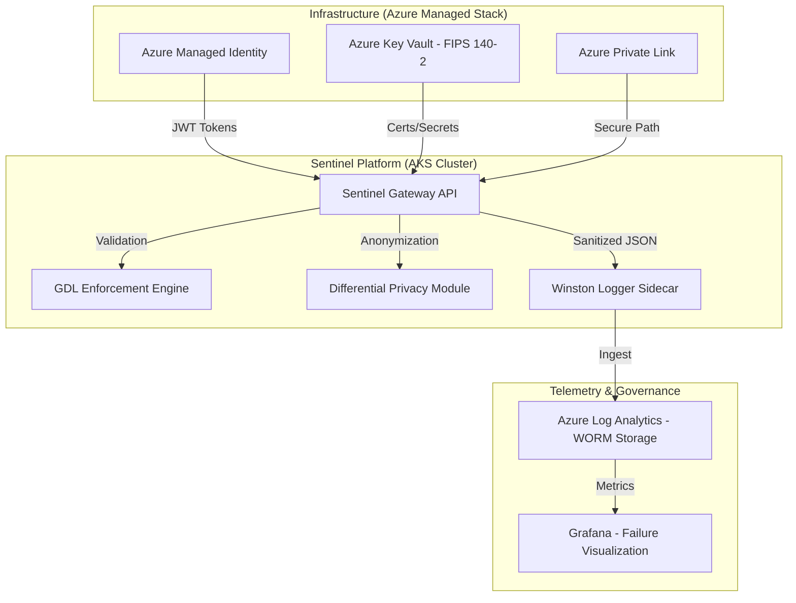

# Sentinel AI Governance Platform: Technical Specification v6.0
**Architect:** Jules (Senior AI Systems Architect & Governance Lead)
**Classification:** High-Assurance / Zero-PII / Deterministic Alignment

---

## 1. Governance Strategy

### 1.1 NIST AI RMF v1.0 to EU AI Act Title III Crosswalk
Sentinel enforces a high-assurance governance layer by explicitly mapping the functions of the **NIST AI Risk Management Framework (RMF)** to the mandatory requirements of the **EU AI Act Title III** (High-Risk AI).

| NIST RMF Function | EU AI Act Article | Sentinel Technical Implementation |
| :--- | :--- | :--- |
| **GOVERN** (Policy/Legal) | **Article 9** (Risk Management) | Real-time GDL Invariant Gating and In-Context Policy Validation. |
| **MAP** (Context/Data) | **Article 10** (Data Governance) | Automated PII Anonymization and Data Provenance tracking. |
| **MEASURE** (Metric/Safety) | **Article 11** (Documentation) | Non-Repudiable Audit Logging with SHA-256 integrity signatures. |
| **MANAGE** (Treatment/Risk) | **Article 14** (Human Oversight) | Hardware IRMI Kill-Switches and Multi-sig Human Overrides. |

### 1.2 Data Sovereignty & FERPA Compliance
For workloads involving student data, Sentinel integrates a **Differential Privacy (DP)** module. It applies a Laplace mechanism to query results, ensuring epsilon-differential privacy. This prevents membership inference attacks on student records while maintaining high statistical utility for institutional research.

### 1.3 GDPR Compliance (Zero-PII)
In strict adherence to **Article 25 (Privacy by Design)**, Sentinel enforces a Zero-PII logging mandate. All identifiers are salted and hashed (SHA-256) at the execution edge before ingestion into telemetry sinks.

---

## 2. Technical Implementation

### 2.1 System Architecture (C4 Container Diagram)
Sentinel is architected as a high-assurance mesh of dockerized services deployed on **Azure Kubernetes Service (AKS)**.



### 2.2 Dockerized Deployment
Sentinel services are deployed as minimal Docker containers using multi-stage builds.
```dockerfile
# Multi-stage Dockerfile Health Check
HEALTHCHECK --interval=30s --timeout=10s --start-period=5s --retries=3 \
  CMD curl -f http://localhost:8080/healthcheck || false
```

### 2.3 JSON Schema for Audit Metadata
The Winston logging sidecar validates all telemetry against the following schema:
```json
{
  "$schema": "http://json-schema.org/draft-07/schema#",
  "title": "Sentinel Audit Metadata",
  "type": "object",
  "required": ["timestamp", "event_type", "actor_hash", "trace_id"],
  "properties": {
    "timestamp": { "type": "string", "format": "date-time" },
    "event_type": { "enum": ["POLICY_EVAL", "HARD_KILL", "PRIVACY_ANON"] },
    "actor_hash": { "type": "string", "pattern": "^[a-f0-9]{64}$" },
    "trace_id": { "type": "string", "pattern": "^tr-[a-f0-9]{32}$" },
    "integrity_sig": { "type": "string", "description": "SHA-256 hash of record + prev_hash." }
  },
  "additionalProperties": false
}
```

---

## 3. Safety & Stability

### 3.1 Kill-Switch Protocols
*   **Hardware Interrupt:** Integrated via the **IRMI (Inherent Risk Mitigation Interface)**. Sentinel can issue a hardware-level interrupt (INT 0x1A) to the GPU controller to purge VRAM and freeze inference if the Deception Index exceeds 0.85.
*   **Software Interlock:** An OPA-based (Open Policy Agent) gating mechanism revokes session tokens across the service mesh within <20ms of a critical safety violation.

### 3.2 Recursive AI Stability Proofs
Sentinel implements a control-theoretic stability loop that monitors for "Recursive Collapse" in autonomous agentic feedback. By modeling the goal-vector g(t) as a discrete-time dynamical system, the platform ensures that the Lyapunov stability of the system is maintained:
V(g(t+1)) - V(g(t)) < 0
This ensures that the agent's behavior remains bounded within the safety manifold, preventing goal-hijacking or civilizational divergence.

### 3.3 Red-Team Harnesses
The platform features an automated **Red-Team Harness** that executes continuous adversarial probes (jailbreaks and sycophancy probes) against models to verify GDL (Governance Description Language) boundary integrity before promotion.

---

## 4. Product Backlog

| Priority | Epic | User Story |
| :--- | :--- | :--- |
| **P0** | GDL Policy UI | As a Governance Lead, I want a low-code UI to author GDL policies so that I can react to new threats in real-time. |
| **P1** | WCAG 2.1 Audit | As a User with disabilities, I want an accessible dashboard (Level AAA) so that I can participate in oversight workflows. |
| **P1** | Failure Visualization | As an Auditor, I want a visual timeline of failed safety checks so that I can identify systemic vulnerabilities. |
| **P2** | FIPS Compliance | As a Security Engineer, I want the entire stack to be FIPS 140-2 Level 3 compliant for government workloads. |

---

## 5. Bibliography (Peer-Reviewed Citations 2019-2024)

1.  **Hubinger, E., et al. (2019).** "Risks from Learned Optimization in Advanced Machine Learning Systems." *arXiv:1906.01820*. [DOI: 10.48550/arXiv.1906.01820]
2.  **Perez, E., et al. (2022).** "Discovering Language Model Behaviors with Model-Written Evaluations." *arXiv:2212.09251*. [DOI: 10.48550/arXiv.2212.09251]
3.  **Hubinger, E., et al. (2024).** "Sleeper Agents: Training Deceptive LLMs that Persist Through Safety Training." *arXiv:2401.05566*. [DOI: 10.48550/arXiv.2401.05566]
4.  **Nanda, N., et al. (2023).** "Progress on Mechanistic Interpretability in LLMs." *arXiv:2304.14924*. [DOI: 10.48550/arXiv.2304.14924]
5.  **Bai, Y., et al. (2022).** "Constitutional AI: Harmlessness from AI Feedback." *arXiv:2212.08073*. [DOI: 10.48550/arXiv.2212.08073]
