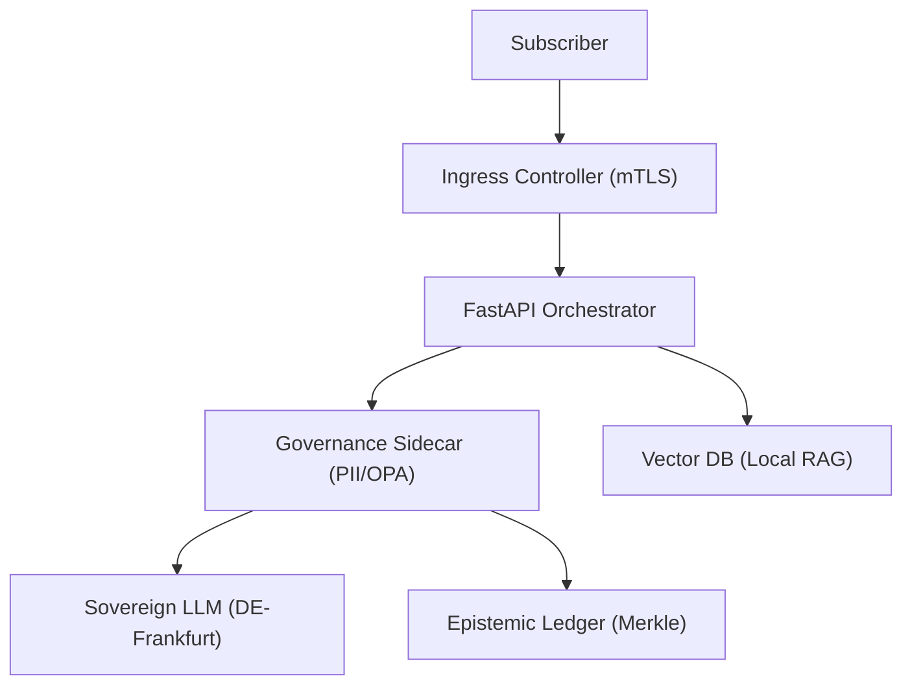

# 1. Executive Summary
This architectural blueprint defines a state-of-the-art, GDPR-compliant customer support system for a Tier-1 German telecommunications provider. The solution utilizes a **Sovereign RAG (Retrieval-Augmented Generation)** architecture, where all inference and data processing are strictly bounded by a German cloud perimeter (Frankfurt region). The system integrates real-time PII redaction and Policy-as-Code (OPA) to ensure 100% compliance with the German Federal Data Protection Act (BDSG) and the EU AI Act.

**Top 3 Critical Risks:**
1.  **PII Leakage in RAG Context**: Accidental inclusion of subscriber IBANs or contract metadata in the LLM prompt window (Violation: GDPR Art. 32).
2.  **Cross-Border Data Drift**: Latent routing of inference requests to non-EEA GPU clusters during high-load failover (Violation: GDPR Art. 44).
3.  **Explainability Gap**: Inability to provide a human-readable justification for automated contract blockages or credit decisions (Violation: EU AI Act Art. 13; GDPR Art. 22).

# 2. Assumptions & Gaps Log
| Assumption | Rationale | Confidence | Impact |
| :--- | :--- | :--- | :--- |
| **Data Sovereignty** | Compute resources are hosted in Open Telekom Cloud or AWS/Azure DE-Frankfurt. | High | Critical |
| **Anonymization** | PII redaction sidecar achieves >99% precision for German naming/address formats. | Medium | Critical |
| **API Integrity** | Telecom CRM supports mTLS for secure context retrieval. | High | Major |

# 3. Governance Framework (RACI Matrix)
| Phase | CMRO | CTO | DPO (Legal) | Lead Developer |
| :--- | :--- | :--- | :--- | :--- |
| **Data Minification** | I | A | R | C |
| **Model Alignment** | A | R | C | C |
| **Inference Gating** | R | I | C | A |
| **Audit Compliance** | R | I | A | R |

# 4. Risk & Compliance Matrix
| Risk Category | Mitigation Strategy | Regulatory Clause |
| :--- | :--- | :--- |
| **Data Privacy** | Implementation of a stateless PII scrubbing sidecar using Presidio and German-specific NER. | GDPR Art. 5(1)(c) |
| **Transparency** | Mandatory "AI Agent" disclosure footer and opt-out path to a human SMF. | EU AI Act Art. 52 |
| **Residency** | Kubernetes Affinity/Anti-Affinity rules enforcing `region == de-frankfurt`. | BDSG § 1(4) |

# 5. Requirements Specification
- **Functional**:
  - As a customer, I want to resolve billing inquiries without my data leaving Germany.
  - As a compliance officer, I want an immutable audit log of all model decisions.
- **Non-Functional**:
  - **Latency**: P99 < 2,500ms (including PII scrubbing overhead).
  - **Security**: Mandatory mTLS for all agent-to-agent (A2A) communication.

# 6. Solution Architecture
**Logical Architecture:**
The system follows a "Governance-as-Sidecar" pattern. The FastAPI orchestrator interacts with the LLM only through a PII Redaction Sidecar that enforces OPA (Open Policy Agent) rules.

**System Diagram:**


**Data Flow:**
1. Subscriber query enters via secured Gateway.
2. Orchestrator retrieves relevant context (contract terms/FAQ) from local Vector DB.
3. Sidecar intercepts the prompt, redacts PII, and validates against OPA policies.
4. LLM generates a response within the sovereign boundary.
5. Response is re-verified for safety markers before delivery to User.

# 7. Implementation Artifacts

**API Specification (YAML):**
```yaml
openapi: 3.0.0
info:
  title: DE Telecom Compliant Chatbot
  version: 1.0.4
paths:
  /v1/chat:
    post:
      summary: GDPR-Compliant Support Inference
      responses:
        '200':
          description: OK
```

**Data Model (Audit Log):**
```sql
CREATE TABLE ai_audit_log (
    event_id UUID PRIMARY KEY,
    timestamp TIMESTAMP WITH TIME ZONE DEFAULT CURRENT_TIMESTAMP,
    user_hash TEXT,
    model_id TEXT,
    pii_redacted BOOLEAN,
    compliance_score FLOAT
);
```

**Policy-as-Code (OPA Rego):**
```rego
package telecom.privacy

default allow = false

# Rule: Deny output if PII is detected in the response stream
allow {
    input.region == "DE"
    not input.pii_detected
}

# Rule: Mandatory AI disclosure must be present
enforce_transparency {
    input.contains_ai_disclosure == true
}
```
