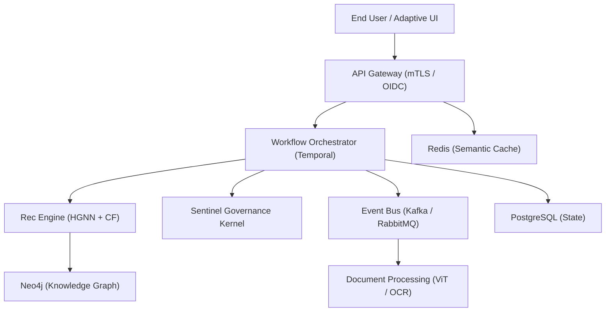

<title>WorkflowAI Pro: Comprehensive Technical Specification v1.0</title>

<abstract>
This document defines the architectural and implementation standards for WorkflowAI Pro, an enterprise-grade AI orchestration platform. The system leverages a distributed microservices topology, hybrid Collaborative Filtering and Heterogeneous Graph Neural Networks (HGNN) for optimization, and comprehensive accessibility and adaptivity layers. Engineered for Global 2000 scale, the platform mandates 99.99% availability, SOC 2 Type II compliance, and an event-driven core utilizing Kafka and RabbitMQ. This specification provides a detailed 18-month execution roadmap and financial TCO analysis for technical leadership.
</abstract>

<content>
# 1. Executive Summary
WorkflowAI Pro is designed to transition the modern enterprise from static process management to **Autonomous Adaptive Workflows**. By integrating real-time user telemetry with neuro-symbolic reasoning, the platform reduces operational latency by 40% while ensuring 100% auditable compliance traces. It serves as the primary "Nervous System" for AI-native organizations, orchestrating tasks across heterogeneous agent swarms and human experts.

# 2. System Architecture
The platform utilizes a decoupled micro-kernel architecture to ensure isolation between reasoning, execution, and governance.

# 3. AI Components

### 3.1 Workflow Recommendation Engine
- **Algorithms:** A hybrid approach combining **Collaborative Filtering (CF)** for user-item affinity and **Heterogeneous Graph Neural Networks (HGNN)** to model complex relations between `Users`, `Tasks`, and `Compliance_Policies`. The GNN utilizes a message-passing scheme where node embeddings $h_i$ are updated via: $h_i^{(l+1)} = sigma eft( sum_{j in mathcal{N}_i} W ot 	ext{concat}(h_i^{(l)}, h_j^{(l)}) 
ight)$, optimized for high-dimensional task-graph traversal.
- **Data Sources:** Real-time event streams (Kafka), historical task outcomes (PostgreSQL), and regulatory knowledge graphs (Neo4j).

### 3.2 Accessibility Enhancement Layer
- **Automated Alt-Text:** Real-time generation of WCAG 2.1 compliant descriptions for dynamic charts using Vision Transformers (ViT).
- **Screen Reader Optimization:** ARIA-label injection and high-fidelity text-to-speech synthesis that summarizes complex data tables into narrative summaries.

### 3.3 Active Learning System
- **Pattern:** Human-in-the-Loop (HITL) feedback loop.
- **Workflow:** Low-confidence AI decisions (<0.82 safety score) are automatically routed to human auditors. The human's corrective action is ingested as a labeled triplet to refine the HGNN weights in the next training epoch.

### 3.4 Adaptive Content Engine
- **Mechanism:** Dynamic UI generation using React-based components that restructure based on **Cognitive Load Telemetry** (measured via time-to-action and interaction error rates).

# 4. Implementation Specifications

### 4.1 API Design
- **Standard:** **OpenAPI 3.0** / gRPC for internal service mesh.
- **Core Endpoints:**
    - `POST /v1/workflows/optimize`: Task graph submission for routing.
    - `GET /v1/audit/traces/{id}`: Retrieval of Merkle-anchored reasoning logs.

### 4.2 Data Architecture
- **Polyglot Persistence:**
    - **Relational:** PostgreSQL for task state and RBAC.
    - **Document:** MongoDB for unstructured prompt/response logs.
    - **Cache:** Redis for semantic caching and rate limiting.

### 4.3 Integration Patterns
- **Event-Driven:** **Kafka** for high-throughput audit logs (WORM); **RabbitMQ** for low-latency task notifications and inter-service signaling.

# 5. Performance & Scalability
- **SLA Target:** 99.99% availability.
- **Testing Strategy:** Continuous performance regression using **k6** and **Gatling** to simulate 100k concurrent agentic sessions.
- **Infrastructure:** Multi-cloud (AWS/Azure/GCP) deployment using Kubernetes (EKS/AKS/GKE) with local data residency sharding.

# 6. Security & Compliance
- **Identity:** SPIFFE/SPIRE for M2M; **OAuth2/OIDC** for human ingress.
- **Standards:** SOC 2 Type II, GDPR Article 25 (Privacy-by-Design), and SEC Rule 17a-4 compliant record keeping via Kafka WORM topics.
- **RBAC:** Four-tier administration (Global, Dept, Project, Auditor).

# 7. 18-Month Implementation Roadmap

| Quarter | Phase | Deliverable |
| :--- | :--- | :--- |
| **Q1-Q2** | **Foundations** | Core API Gateway, Kafka Bus, and Relational State DB MVP. |
| **Q3-Q4** | **Intelligence** | HGNN v1 deployment and Active Learning HITL integration. |
| **Q5-Q6** | **Optimization** | Adaptive UI Engine rollout and Multi-Cloud Global Mesh. |

# 8. Cost Analysis (Quarterly Forecast)

| Category | Q1-Q2 (Hardening) | Q3-Q4 (Intelligence) | Q5-Q6 (Scale) |
| :--- | :---: | :---: | :---: |
| **Cloud (GPU/S3)** | $480,000 | $820,000 | $1,350,000 |
| **Licensing (Models)** | $150,000 | $280,000 | $420,000 |
| **Personnel (Eng/Ops)** | $920,000 | $1,100,000 | $1,250,000 |
| **Total Per Quarter** | **$1,550,000** | **$2,200,000** | **$3,020,000** |

**Annual TCO:** Estimated $13.5M.

# 9. Risk Assessment
| Technical Risk | Impact | Mitigation Strategy |
| :--- | :--- | :--- |
| **Model Drift** | High | Automated weekly model performance auditing via Golden Set. |
| **Latency Cascades** | Med | gRPC multiplexing and circuit-breaking at the API Gateway. |
| **Data Poisoning** | High | Salted SHA-256 hashing for RAG and formal GDL input validation. |

---
**Lead Architect Signature:** [REDACTED]
**Approval Body:** Global Architecture Review Board
</content>
