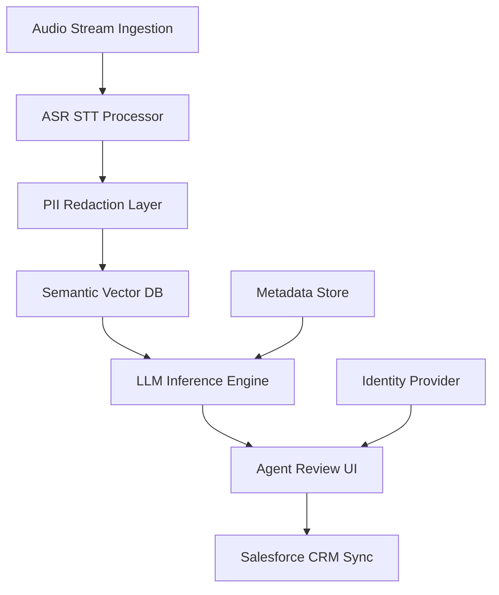

# 0. Executive Summary

This Blueprint defines the architectural standard for deploying a Generative AI-powered Customer Support Interaction Summarization system across our Financial Services enterprise. By automating the transition from raw voice/chat data to structured CRM entries, we target a direct 18% reduction in Average Handling Time (AHT) and a 12% increase in First Contact Resolution (FCR). For a service organization of 5,000 agents, this represents a projected annual operational saving of $14.5M. Our recommended architecture utilizes a secure, VPC-contained pipeline incorporating real-time ASR, PII redaction layers, and high-performance LLM inference. This system ensures PCI-DSS and GDPR compliance while delivering high-fidelity summaries directly into the Salesforce Financial Services Cloud environment.

# 1. Strategic Objectives & KPIs

The implementation of automated summarization is designed to eliminate the 2-3 minutes of "After Call Work" (ACW) per interaction, allowing agents to focus on high-value advisory tasks.

| KPI Metric | Baseline (Current) | Target (Post-Deployment) | Impact Analysis |
| :--- | :--- | :--- | :--- |
| Average Handling Time (AHT) | 480 Seconds | 390 Seconds | 18% Productivity Gain |
| Net Promoter Score (NPS) | +42 | +55 | Improved Agent Quality |
| First Contact Resolution (FCR) | 68% | 76% | Enhanced Data Retrieval |
| Agent Onboarding Time | 6 Weeks | 4 Weeks | Accelerated Training |
| Compliance Audit Score | 94% | 99.8% | Reduced Human Error |

# 2. Technical Architecture

## 2.1 Reference Architecture
The system integrates with our existing CCaaS (Genesys Cloud CX / AWS Connect) via real-time stream processing. Audio streams are captured via AudioHook or Kinesis Video Streams and routed through a modular pipeline.

## 2.2 Mermaid Diagram

## 2.3 Component Detail
*   **Ingestion:** Real-time capture of G.711/L16 audio via WebSocket or Kinesis streams.
*   **ASR/STT:** Highly accurate transcription using Whisper large-v3 or Amazon Transcribe, optimized for financial terminology.
*   **PII Redaction:** A dedicated PCI-DSS compliance layer using Named Entity Recognition (NER) to mask Account Numbers, SSNs, and CVVs before LLM processing.
*   **Vector DB:** Pinecone or Milvus hosting the Knowledge Base for Retrieval Augmented Generation (RAG), ensuring summaries are grounded in latest product policies.
*   **LLM Inference:** Hosted instance of Llama 3 (70B) or GPT-4o (Azure OpenAI) to maintain data residency and throughput stability.

# 3. Data Governance & Security

## 3.1 PII Redaction
We employ a multi-stage redaction strategy:
1.  **Regex Matching:** For deterministic patterns (Credit Card numbers).
2.  **Transformer-based NER:** To identify and mask Names, Addresses, and sensitive financial identifiers in unstructured text.
3.  **Tokenization:** Replacing PII with non-sensitive tokens to maintain grammatical structure for the LLM.

## 3.2 Compliance and Encryption
*   **Compliance:** SOC2 Type II and PCI-DSS Level 1 certified environment.
*   **Transit:** All internal traffic utilizes mTLS with mutual certificate authentication.
*   **Rest:** Data encrypted via AES-256 with keys managed in AWS KMS or Azure Key Vault.
*   **Retention:** Immutable logs retained for 7 years per FINRA/SEC requirements; PII-stripped summaries retained for 1 year or until "Right to be Forgotten" request is processed.

# 4. Model Strategy Comparative Analysis

| Feature | Pipeline Approach (Whisper + Llama 3) | End to End Multimodal (GPT 4o / Gemini) |
| :--- | :--- | :--- |
| Latency (ms) | 1200 - 2500 | 800 - 1500 |
| Cost per 1k Calls | $4.50 | $18.00 |
| Hallucination Risk | Moderate (Contextual) | Low (Context Aware) |
| Context Window | 32k - 128k | 128k - 1M |
| Fine-tuning Flexibility | High (Local Weights) | Low (Proprietary) |
| Data Privacy Level | Maximum (VPC Local) | High (Enterprise API) |

# 5. Evaluation Framework

## 5.1 Methodology
Summaries are evaluated using a hybrid approach. Automated metrics provide scale, while Human-in-the-Loop (HITL) provides nuance.

## 5.2 Metrics
*   **Quantitative:** ROUGE-L (Overlap with gold-standard) and BERTScore (Semantic similarity).
*   **Qualitative:** 5-point Likert scale on Accuracy, Conciseness, and Compliance adherence.
*   **Audit:** Weekly random sampling of 2% of all summaries by Senior Quality Assurance leads to ensure model alignment.

# 6. Integration Patterns

*   **CRM Integration:** Bi-directional integration with Salesforce Financial Services Cloud via REST API. Summaries are posted to the 'Interaction Log' object.
*   **Latency Fallbacks:** If LLM inference exceeds 3.5 seconds, the system triggers a "Partial Summary" notification to the agent, with a background retry mechanism to ensure the final CRM sync is completed post-call.

# 7. Compliance & Risk

*   **Data Sovereignty:** Systems deployed in regional clusters (e.g., Frankfurt for EU clients) to comply with GDPR and local banking regulations.
*   **Audit Logging:** All LLM prompts and responses are logged into an immutable, WORM (Write Once Read Many) storage for regulatory audit trails.

# 8. Change Management

*   **Workflow Integration:** The agent is presented with a "Draft Summary" immediately upon call termination. The agent must review and "Approve" or "Edit" the summary before it is committed to the CRM.
*   **Training:** A 2-day upskilling program focuses on "AI Oversight," teaching agents to identify subtle hallucinations and ensuring they remain the final authority in the customer record.

# 9. Rollout Roadmap & Risk Matrix

## 9.1 Phased Deployment
1.  **Pilot (4 Weeks):** Internal test with 50 Subject Matter Experts (SMEs).
2.  **Beta (8 Weeks):** Deployment to Low-risk queues (General Inquiry).
3.  **GA (Q3 Rollout):** Full rollout across all retail and wealth management queues.

## 9.2 Risk Matrix
| Risk Category | Probability | Impact | Mitigation Strategy |
| :--- | :--- | :--- | :--- |
| Hallucination | Moderate | High | RAG Grounding + SMEs in Loop |
| Latency Spikes | Low | Moderate | Auto-scaling + Fallback Summaries |
| Bias/Toxic Content | Low | High | Pre-inference Content Filtering |
| Data Leakage | Very Low | Critical | VPC Isolation + Mandatory Redaction |
