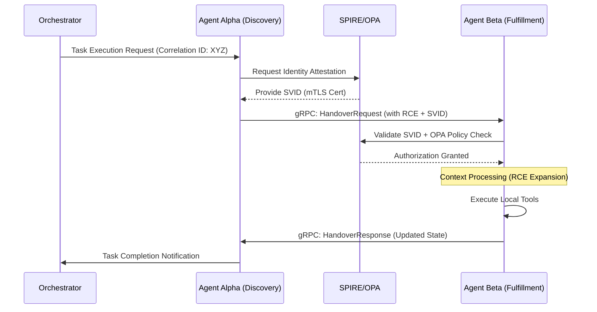

# Enterprise AI Agent Interoperability Protocol (EAIP) Specification

## 1. Necessity of Standardization

The current landscape of autonomous agents is characterized by fragmented execution frameworks and proprietary messaging formats. This heterogeneity introduces significant technical debt and operational risk for enterprise-scale deployments. The Enterprise AI Agent Interoperability Protocol (EAIP) addresses these challenges through a unified standard that facilitates:

- **Elimination of Vendor Lock-in**: Standardizing communication between agents allows for a modular, swappable architecture across LLM providers and agentic frameworks.
- **Robust Governance and Compliance**: A standardized protocol ensures that every agent-to-agent interaction is auditable, traceable, and subject to centralized policy enforcement.
- **Operational Efficiency**: Uniform protocols for task delegation, capability discovery, and context handoff reduce integration complexity and latency in distributed agent workflows.
- **Semantic Consistency**: Establishing a shared ontology and state management model ensures that intent and constraints are preserved across multi-agent handoffs.

## 2. API Architecture: Comparative Analysis and Recommendation

Enterprise agentic workflows necessitate low-latency, high-throughput, and type-safe communication. The following table summarizes the comparative analysis of transport protocols for EAIP:

| Feature | REST (JSON) | WebSockets | gRPC (HTTP/2 + Protobuf) |
| :--- | :--- | :--- | :--- |
| **Serialization** | Text (Heavy) | Variable (Often JSON) | Binary (Efficient) |
| **Streaming** | Unidirectional (SSE) | Full Duplex | Bidirectional Streaming |
| **Type Safety** | Schema-on-read | None (Manual) | Schema-on-write (Strict) |
| **Governance** | Weak (OpenAPI) | None | Strong (Proto/Svc Definitions) |

### Definitive Recommendation: gRPC
EAIP mandates **gRPC** as the primary transport layer. The decision is driven by the need for bidirectional streaming to handle long-running agentic state updates and the performance benefits of Protocol Buffers.

#### EAIP Core Service Definition (Protobuf)
```protobuf
syntax = "proto3";

package eaip.v1;

service AgentService {
  // Bidirectional stream for continuous state and context exchange
  rpc Coordinate(stream InteractionRequest) returns (stream InteractionResponse);

  // Handover a task to another agent synchronously
  rpc Handover(HandoverRequest) returns (HandoverResponse);
}

message InteractionRequest {
  string agent_id = 1;
  string correlation_id = 2;
  bytes context_payload = 3;
}
```

## 3. IAM for Autonomous Agents: SPIFFE/SPIRE Framework

In a distributed agentic ecosystem, traditional user-centric IAM (OAuth2/OpenID) is insufficient. EAIP leverages **SPIFFE** (Secure Production Identity Framework for Everyone) and **SPIRE** (the SPIFFE Runtime Environment) to provide a standardized, cryptographic identity layer for autonomous agents.

### Implementation Strategy
1. **Workload Attestation**: SPIRE agents attest the agent process based on kernel-level properties (e.g., K8s pod labels, binary SHA, service account).
2. **SVID Issuance**: Successfully attested agents receive a **SPIFFE Verifiable Identity Document (SVID)**, typically in X.509 or JWT format.
3. **mTLS-based Communication**: Agents utilize SVIDs to establish mutual TLS (mTLS) channels. This ensures:
   - **Mutual Authentication**: Both the caller and callee agents verify identities before data exchange.
   - **Transport Encryption**: All agent-to-agent traffic is encrypted at the transport layer.
   - **Identity Transparency**: The SPIFFE ID (e.g., `spiffe://cluster.local/ns/ai/agent/customer-support`) is embedded in the interaction logs for non-repudiation.

### Policy Enforcement (OPA Integration)
EAIP mandates the use of **Open Policy Agent (OPA)** alongside SPIRE to evaluate Fine-Grained Access Control (FGAC). While SPIRE provides *identity*, OPA validates if `agent-A` is *authorized* to invoke the `Handover` RPC on `agent-B` based on current mission constraints.

## 4. State & Error Management Protocols

Reliable agentic handoffs require consistent state synchronization and predictive error handling to prevent "hallucination loops" and execution deadlocks.

### Context Handoff Mechanism
EAIP implements a **Recursive Context Envelope (RCE)** model. When `Agent-A` hands off to `Agent-B`, it MUST provide:
- **Trace Context**: W3C Traceparent for distributed tracing compatibility.
- **Semantic State Snapshot**: A compressed Protobuf message containing the current state of the objective, past actions, and constraints.
- **Memory Buffer**: A prioritized list of past observation tokens to maintain continuity.

### Standardized Error Codes and Fallbacks
To ensure interoperability, EAIP defines a subset of custom gRPC error codes:

| Code | Label | Trigger Condition | Standard Fallback |
| :--- | :--- | :--- | :--- |
| **0x101** | `CAPABILITY_MISSING` | Agent cannot satisfy requested tool/action. | Route to capability discovery service. |
| **0x102** | `AGENT_LOOP_DETECTED` | Recursive calls exceed predefined `depth_limit`. | Terminate and return state to orchestrator. |
| **0x103** | `CONTEXT_OVERFLOW` | Input payload exceeds agent window limit. | Apply semantic summarization middleware. |
| **0x104** | `POLICY_VIOLATION` | OPA check fails for the specific interaction. | Log event and reject connection. |

### Circuit Breaking and Retries
Agents MUST implement exponential backoff with jitter for transient errors. If a downstream agent returns `UNAVAILABLE` or `DEADLINE_EXCEEDED`, the orchestrator MUST initiate a "graceful degradation" path, either by re-routing or escalating to a human-in-the-loop (HITL) interface.

## 5. Reference Architecture Diagram: Agent-to-Agent Handoff

The following sequence diagram illustrates the EAIP-compliant handoff process between two autonomous agents, including identity verification and policy enforcement.


