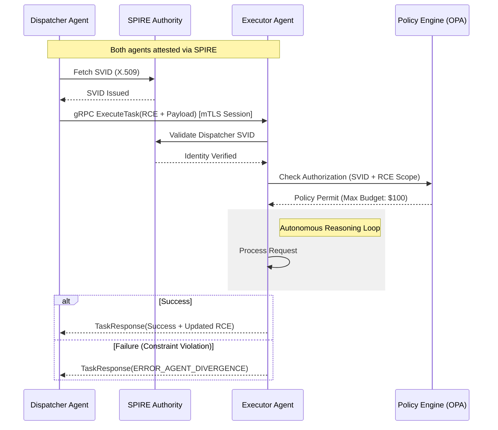

# 1. Necessity of Standardization

The transition from assistive "Co-pilot" models to autonomous agentic swarms within enterprise infrastructure has introduced critical architectural bottlenecks collectively defined as **Agentic Entropy**. Current bespoke integrations between heterogeneous agents result in $O(n^2)$ complexity and brittle orchestration patterns. Standardization via the Enterprise AI Agent Interoperability Protocol (EAIP) is mandated for:

- **Computational Efficiency**: At scale, the serialization overhead of text-based protocols (REST/JSON) results in prohibitive CPU cycle waste and latency bloat during high-frequency recursive reasoning loops.
- **Semantic Continuity**: "Lossy" handoffs lead to context fragmentation. Standardizing the state vector transfer ensures reasoning provenance is preserved across multi-agent chains, preventing hallucination cascades.
- **Non-Repudiation**: Privileged autonomous actions (e.g., financial reconciliation or infrastructure modification) require cryptographically verifiable identities for forensic auditability and real-time policy enforcement.
- **$O(n)$ Integration Scaling**: EAIP provides a canonical interface that allows for plug-and-play agent discovery and task delegation across multi-vendor ecosystems.

# 2. API Architecture: The gRPC Mandate

The transport layer defines the operational ceiling for agentic ecosystems. Agentic workflows require high-concurrency, low-latency, and native support for long-running bidirectional reasoning tasks.

### 2.1 Comparative Analysis
| Feature | REST (OpenAPI/JSON) | WebSockets | gRPC (HTTP/2 + Protobuf) |
| :--- | :--- | :--- | :--- |
| **Serialization** | Text-based (Inconsistent) | Variable | Binary (Highly Efficient) |
| **Contract Type** | Loose / Runtime | Implicit / Custom | Strict / Compile-time (IDL) |
| **Multiplexing** | No (Head-of-Line Blocking) | Native | Native (Single TCP Conn) |
| **Streaming** | Unidirectional Only | Full Duplex | Bidirectional / Multi-stream |

### 2.2 Definitive Recommendation: gRPC over HTTP/2
**EAIP strictly mandates gRPC as the transport protocol.**
The Protocol Buffers (Protobuf) binary wire format provides up to an 80% reduction in payload size compared to JSON and sub-millisecond serialization speeds. gRPC’s native support for bidirectional streaming facilitates **Negotiated Reasoning Streams (NRS)**, where agents iteratively refine task parameters over a single persistent connection, eliminating the latency penalties of repeated TLS handshakes.

# 3. IAM for Autonomous Agents: SPIFFE/SPIRE Architecture

Standard human-centric identity models (OAuth2/OIDC) fail at machine speeds. EAIP leverages **Machine Identity** via **SPIFFE (Secure Production Identity Framework for Everyone)**.

- **Workload Identity (SPIFFE ID)**: Each agent class is assigned a unique, non-IP-based identity (e.g., `spiffe://trust.domain/ns/finance/agent/reconciler`).
- **Attestation**: The **SPIRE** (SPIFFE Runtime Environment) agent performs workload attestation by measuring binary hashes, container image digests, and runtime metadata before issuing credentials.
- **SVID and mTLS**: Agents are issued short-lived X.509 **SPIFFE Verifiable Identity Documents** (SVIDs). All EAIP traffic must terminate Mutual TLS (mTLS). SPIRE handles automatic certificate rotation (e.g., < 1 hour), minimizing the blast radius of potential credential compromise.

# 4. State & Error Management: The RCE Protocol

EAIP introduces the **Recursive Context Envelope (RCE)** for distributed state propagation and context handoffs.

### 4.1 Recursive Context Envelope (RCE)
The RCE is a standardized metadata header accompanying every EAIP call. It utilizes a **Merkle-DAG** structure to ensure context integrity:
- **Trace Context**: W3C Trace Context compatible (TraceID/SpanID) for end-to-end swarm observability.
- **Reasoning Provenance Hash**: A cryptographic link to a distributed context store, allowing the receiver to "hydrate" only relevant reasoning fragments rather than re-transmitting entire histories.
- **Recursion Guard**: An integer TTL for agentic delegation to prevent infinite reasoning loops or "Agent Sprawl."

### 4.2 Error Taxonomy
EAIP defines deterministic mappings of gRPC status codes to agentic failure modes:
- `ERROR_AGENT_DIVERGENCE` (Status: `FAILED_PRECONDITION`): Executor plan violates dispatcher safety guardrails.
- `ERROR_CONTEXT_DRIFT` (Status: `DATA_LOSS`): The RCE failed integrity verification or semantic coherence check.
- `ERROR_HITL_REQUIRED` (Status: `UNAVAILABLE`): A terminal logical deadlock requiring human intervention.

# 5. Reference Architecture Diagram

