# Enterprise AI Agent Interoperability Protocol (EAIP) v1.0

## 1. Necessity of Standardization: Business and Technical Drivers

The rapid transition from "Co-pilot" (assistive) to "Agent" (autonomous) architectures has introduced a critical integration bottleneck within the enterprise: **Agentic Entropy**. In an ecosystem of heterogeneous agents, bespoke integrations lead to $O(n^2)$ complexity. Standardization via EAIP is mandated for:

- **Semantic Cohesion**: Preventing context loss during agent-to-agent delegation.
- **Computational Efficiency**: Reducing serialization overhead for high-frequency reasoning loops.
- **Auditability & Non-Repudiation**: Ensuring all autonomous actions are traceable to cryptographically verified identities.
- **Safety Enforcement**: Enabling "Governance-as-a-Proxy" for real-time validation of agentic tool-calls against organizational guardrails.

## 2. API Architecture: The gRPC Mandate

The transport layer defines the operational limits of agentic collaboration. Autonomous agents require high-concurrency, low-latency, and native bidirectional streaming for negotiated reasoning.

### 2.1 Comparative Analysis
| Feature | REST (OpenAPI/JSON) | WebSockets | gRPC (HTTP/2 + Protobuf) |
| :--- | :--- | :--- | :--- |
| **Serialization** | Text (Inconsistent) | Variable | Binary (Highly Efficient) |
| **Contract Type** | Loose / Runtime | Implicit | Strict / Compile-time (IDL) |
| **Multiplexing** | No (HOL Blocking) | Native | Native (Single TCP Conn) |
| **Streaming** | Unidirectional Only | Full Duplex | Bidirectional / Multi-stream |

### 2.2 Recommendation: gRPC
**EAIP strictly mandates gRPC as the canonical transport mechanism.**
Protocol Buffers (Protobuf) provide up to an 80% reduction in compute cycles for serialization compared to JSON. gRPC’s bidirectional streaming facilitates **Negotiated Reasoning Streams (NRS)**, where agents iteratively refine task parameters over a single persistent connection, eliminating the latency penalties of repeated TLS handshakes.

#### EAIP Service Definition (Conceptual Proto)
```protobuf
syntax = "proto3";
package eaip.v1;

service AgentInteroperability {
  // Primary method for negotiated task execution
  rpc ExecuteTask(stream TaskEnvelope) returns (stream TaskResponse);

  // Capability discovery and lease negotiation
  rpc NegotiateCapabilities(CapabilityQuery) returns (CapabilityLease);
}

message TaskEnvelope {
  string task_id = 1;
  ContextEnvelope context = 2; // The RCE
  bytes payload = 3; // Domain-specific data
}
```

## 3. IAM for Autonomous Agents: SPIFFE/SPIRE

Standard human-centric identity models fail at machine speed. EAIP leverages **SPIFFE (Secure Production Identity Framework for Everyone)** for decentralized identity.

- **Workload Identity (SPIFFE ID)**: Agents are assigned unique identities following the namespace: `spiffe://trust.domain/ns/{namespace}/agent/{class}/{id}`.
- **Attestation**: The **SPIRE** agent performs multi-modal attestation (binary hash, container image digest, and K8s metadata) before issuing an X.509 **SPIFFE Verifiable Identity Document (SVID)**.
- **mTLS Enforcement**: All EAIP communication occurs over Mutual TLS (mTLS). SVIDs serve as both the identity and the cryptographic basis for encryption. SPIRE handles sub-hour certificate rotation, minimizing the blast radius of credential theft.

## 4. State & Error Management: The RCE Protocol

### 4.1 Recursive Context Envelope (RCE)
Context fragmentation is the primary cause of multi-agent failure. EAIP introduces the **RCE**, a standardized metadata header utilizing a **Merkle-DAG** structure:
- **Trace Context**: W3C Trace Context compatible (TraceID/SpanID).
- **Reasoning Provenance**: A cryptographic hash-link to the distributed context store, allowing the receiver to "hydrate" only relevant reasoning fragments.
- **Recursion Guard**: An integer TTL to prevent infinite reasoning loops in autonomous swarms.

### 4.2 Standardized Error Taxonomy
EAIP defines deterministic mappings of gRPC status codes to agentic failure modes:
- `ERROR_AGENT_DIVERGENCE` (Status: `FAILED_PRECONDITION`): Executor plan violates dispatcher safety guardrails.
- `ERROR_CONTEXT_DRIFT` (Status: `DATA_LOSS`): The RCE failed integrity verification or semantic coherence checks.
- `ERROR_HITL_REQUIRED` (Status: `UNAVAILABLE`): A terminal logical deadlock requiring human intervention.

## 5. Reference Architecture Diagram

```mermaid
sequenceDiagram
    participant Disp as Dispatcher Agent
    participant SPIRE as SPIRE Authority
    participant Exec as Executor Agent
    participant OPA as Policy Engine (OPA)

    Note over Disp, Exec: Both agents attested via SPIRE

    Disp->>SPIRE: Fetch SVID (X.509)
    SPIRE-->>Disp: SVID Issued

    Disp->>Exec: gRPC ExecuteTask(RCE + Payload) [mTLS]

    Exec->>SPIRE: Validate Dispatcher SVID
    SPIRE-->>Exec: Identity Verified

    Exec->>OPA: Check Authorization (SVID + RCE Scope)
    OPA-->>Exec: Policy Permit (Max Budget: $100)

    rect rgb(30, 30, 30)
    Note right of Exec: Autonomous Reasoning Loop
    Exec->>Exec: Process Request
    end

    alt Success
        Exec-->>Disp: TaskResponse(Success + Updated RCE)
    else Failure (Constraint Violation)
        Exec-->>Disp: TaskResponse(ERROR_AGENT_DIVERGENCE)
    end
```



### 4.3 Detailed Wire Format: Recursive Context Envelope (RCE)

To ensure interoperability across Rust, Go, and Python runtimes, the RCE utilizes the following strictly typed structure within the `TaskEnvelope`:

```protobuf
message ContextEnvelope {
  string trace_id = 1; // W3C format
  string parent_span_id = 2;

  // State Graph references
  message ReasoningLink {
    string agent_id = 1;
    string thought_hash = 2; // SHA-256 of the local reasoning trace
    string store_uri = 3;    // Location of hydrated state
  }
  repeated ReasoningLink provenance_chain = 3;

  // Delegation Guardrails
  message DelegationPolicy {
    int32 max_depth = 1;
    int32 current_depth = 2;
    double financial_limit = 3;
    string currency = 4;
  }
  DelegationPolicy policy = 4;
}
```

### 4.4 Authorization Policy Example (Rego)

EAIP Executor agents utilize sidecar-based OPA enforcement. Below is a production-grade policy for validating a delegation request:

```rego
package eaip.authz

import input.context.policy
import input.peer.spiffe_id

default allow = false

allow {
    is_authorized_agent
    within_recursion_limit
    within_financial_bound
}

is_authorized_agent {
    # Ensure the calling agent is in the trusted finance namespace
    startswith(spiffe_id, "spiffe://enterprise.com/ns/finance/")
}

within_recursion_limit {
    policy.current_depth < policy.max_depth
}

within_financial_bound {
    # Enforce a hard cap of $100.00 for autonomous sub-tasks
    policy.financial_limit <= 100.0
}
```

## 6. Implementation Guidelines for Backend Teams

1.  **Transport**: Mandate HTTP/2 for gRPC. Disable HTTP/1.1 fallback to prevent downgrade attacks.
2.  **Identity**: Configure SPIRE with TPM attestation for Layer 0 security. Use short-lived SVIDs (TTL < 3600s).
3.  **State**: Implement a "Hydration Sidecar" that pre-fetches reasoning fragments from the Vector Store based on the RCE hashes before the agent process begins inference.
4.  **Error Handling**: map `ERROR_AGENT_DIVERGENCE` to a deterministic "Reasoning Reset" flow where the Dispatcher provides additional constraints to the Executor instead of failing the entire swarm.
