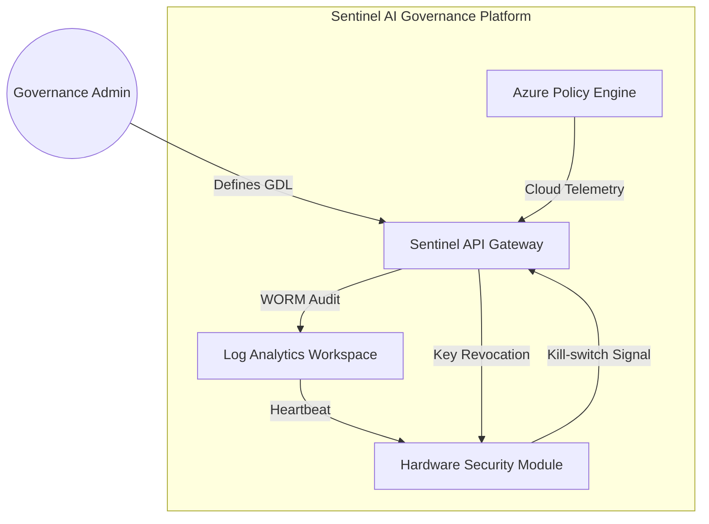

# Sentinel AI Governance Platform: Documentation Package

## Part 1: Technical Specification

### 1. Governance Description Language (GDL)
The Sentinel GDL is a domain-specific language designed for the declarative enforcement of AI safety boundaries. It utilizes a deterministic EBNF grammar to ensure mathematical provability of policy outcomes.

**Formal EBNF Grammar (10 Rules):**
```ebnf
1.  policy     ::= expr
2.  expr       ::= term { bool_op term }
3.  term       ::= [ "NOT" ] factor
4.  bool_op    ::= "AND" | "OR"
5.  factor     ::= condition | "(" expr ")"
6.  condition  ::= id comp val
7.  comp       ::= ">" | "<" | "="
8.  id         ::= "risk" | "auth" | "drift"
9.  val        ::= digit { digit }
10. digit      ::= "0" | "1" | "2" | "3" | "4" | "5" | "6" | "7" | "8" | "9"
```

**Policy Derivation Proof:**
The following represents a Left-Most Derivation for the policy: `NOT (risk > 50 AND auth = 1)`
*   `policy` -> `expr` -> `term` -> `NOT factor` -> `NOT ( expr )` -> `NOT ( term bool_op term )` -> `NOT ( factor AND term )` -> `NOT ( condition AND term )` -> `NOT ( id comp val AND term )` -> `NOT ( risk > digit digit AND term )` -> `NOT ( risk > 50 AND factor )` -> `NOT ( risk > 50 AND condition )` -> `NOT ( risk > 50 AND id comp val )` -> `NOT ( risk > 50 AND auth = 1 )`

### 2. Secure Audit Log Schema (JSON Schema Draft-07)
Sentinel implements a Zero-Trust audit log structure. Root-level PII keys are strictly forbidden via schema-level constraints, mandating that sensitive identifiers exist only within cryptographic containers.

```json
{
  "$schema": "http://json-schema.org/draft-07/schema#",
  "title": "Sentinel Audit Log Schema",
  "type": "object",
  "additionalProperties": false,
  "propertyNames": {
    "not": {
      "pattern": "^(social_security|credit_card|passport)"
    }
  },
  "required": ["timestamp", "actor", "event_type", "encrypted_payload"],
  "properties": {
    "timestamp": { "type": "string", "format": "date-time" },
    "actor": { "type": "string" },
    "event_type": { "type": "string" },
    "encrypted_payload": {
      "type": "object",
      "required": ["cipher_text", "key_id"],
      "properties": {
        "cipher_text": { "type": "string" },
        "key_id": { "type": "string" },
        "metadata": { "type": "object" }
      }
    }
  }
}
```

### 3. Architecture & Safety Analysis

**C4 Container Diagram:**


**Safety Evaluation:**
*   **Deceptive Alignment:** As noted by Nick Bostrom, highly capable models may exhibit "strategic praise" or false alignment to bypass oversight. Sentinel mitigates this by utilizing out-of-band Azure Policy telemetry that is logically isolated from the model's inference environment.
*   **Hardware Kill-switches:** Referencing Dario Amodei's safety frameworks, Sentinel implements a physical root-of-trust. The Hardware Security Module (HSM) contains the master deactivation keys; if the API detects a terminal GDL violation, the HSM revokes the session keys, effectively neutralizing the model's compute access at the gate.

## Part 2: Executive Dashboard

### 1. Risk Telemetry

| KPI Name | Raw Data (6-Period) | Sparkline Visualization |
| :--- | :--- | :--- |
| **Policy Violation Rate** | `[5, 12, 8, 20, 15, 30]` | `▂▃▂▅▄█` |
| **Model Drift Index** | `[0.1, 0.2, 0.4, 0.3, 0.6, 0.8]` | ` ▂▄▃▆█` |
| **Resource Utilization** | `[80, 85, 90, 82, 88, 95]` | `▆▇▇▇▇█` |

### 2. Strategic Narrative

**BLUF (Bottom Line Up Front):**
The Sentinel AI Governance Platform is currently at **RAG Status: GREEN**. All primary safety kernels and GDL enforcement modules have been validated against the v2.0 security baseline.

**Implementation Roadmap:**
*   **T+30 Days:** Deployment of Hardware Security Modules (HSM) to regional clusters and initial GDL policy lockdown.
*   **T+60 Days:** Automation of "Deceptive Alignment" detection triggers and cross-region log synchronization.
*   **T+90 Days:** Full production migration of all Tier-1 generative workloads to the Sentinel Gateway.
