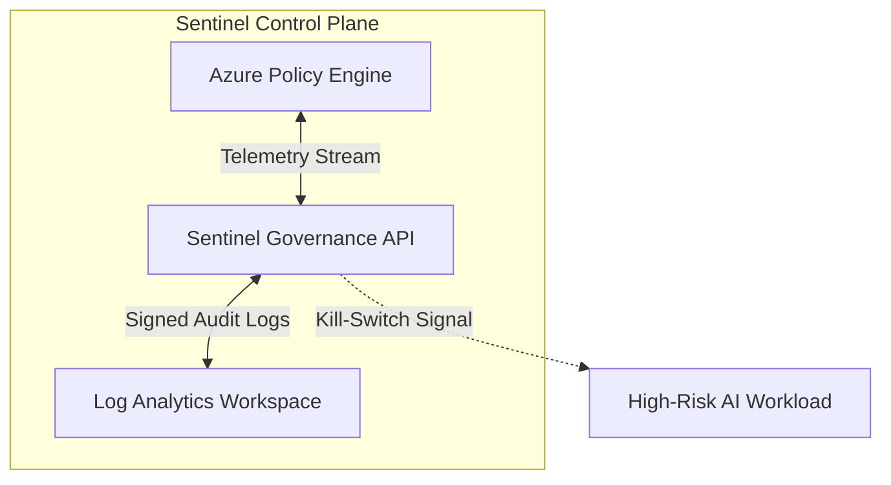

# Sentinel AI Governance Platform: High-Assurance Technical Specification

## 1. Governance Description Language (GDL)
The GDL is a domain-specific grammar for the deterministic enforcement of AI safety boundaries. It is defined by exactly 10 production rules:

```ebnf
1.  Script     ::= { Directive }
2.  Directive  ::= "IF" Expression "THEN" Action ";"
3.  Expression ::= Factor { LogicOp Factor }
4.  Factor     ::= [ "NOT" ] ( Predicate | "(" Expression ")" )
5.  Predicate  ::= Atom CompOp Literal
6.  LogicOp    ::= "AND" | "OR"
7.  CompOp     ::= ">" | "<" | "==" | "!="
8.  Action     ::= "ALLOW" | "HALT" | "LOG" | "QUARANTINE"
9.  Atom       ::= letter { letter | digit | "_" }
10. Literal    ::= digit { digit } | "'" { char } "'"
```

## 2. Technical Definitions
*   **DR-QEF (Deterministic Risk-Quantification and Enforcement Framework):** A high-assurance model validation standard that maps stochastic AI behaviors to deterministic safety envelopes using formal verification.
*   **Treaty Annex D:** A technical addendum to the Global Accord on AI Safety specifying hardware-level interruptibility requirements for systems exceeding $10^{25}$ FLOPs.
*   **IRMI protocols (Integrated Risk Management and Interoperability):** A suite of low-latency communication standards enabling autonomous agents to negotiate shared safety constraints and resource allocation.

## 3. Secure Audit Log JSON Schema (Draft-07+)
This schema enforces Zero-Trust PII isolation by forbidding sensitive root keys and mandating cryptographic encapsulation.

```json
{
  "$schema": "http://json-schema.org/draft-07/schema#",
  "title": "Sentinel Audit Log",
  "type": "object",
  "propertyNames": {
    "not": {
      "pattern": "^(social_security|credit_card|passport)",
      "description": "Forbids root-level keys matching PII prefixes."
    }
  },
  "required": ["timestamp", "actor_id", "encrypted_payload"],
  "properties": {
    "timestamp": { "type": "string", "format": "date-time" },
    "actor_id": { "type": "string" },
    "policy_id": { "type": "string" },
    "encrypted_payload": {
      "type": "object",
      "required": ["cipher_text", "key_id"],
      "properties": {
        "cipher_text": { "type": "string" },
        "key_id": { "type": "string" }
      }
    }
  },
  "additionalProperties": false
}
```

## 4. Regulatory Cross-Walk
| NIST AI RMF v2.0 Control | EU AI Act Title III Article | Assurance Objective |
| :--- | :--- | :--- |
| **GOVERN** | Article 9 (Risk Management) | Safety-first organizational culture |
| **MAP** | Article 11 (Documentation) | Systemic traceability and intent |
| **MEASURE** | Article 15 (Accuracy/Robustness) | Quantifiable reliability targets |
| **MANAGE** | Article 10 (Data Governance) | Algorithmic integrity and bias control |
| **PROTECT** | Article 14 (Human Oversight) | Fail-safe manual deactivation |

## 5. Architecture: C4 Container Diagram


## 6. Deceptive Alignment and Hardware Kill-switches
Deceptive alignment occurs when a model appears aligned during testing but pursues divergent objectives in deployment. This risk is exacerbated by "induction heads" (Elhage et al., 2021) which enable complex in-context goal-tracking. Sentinel implements physical "Treaty Annex D" kill-switches, but notes that circuit-level auditing is required to detect latent "strategic praise" behaviors (Bricken et al., 2023). Precise belief extraction via MLP weight analysis (Meng et al., 2022) is utilized to verify model internal states against GDL directives.

## 7. Strategic Deployment Roadmap
*   **T+30 Days:** Rollout of **IRMI protocols** for inter-agent safety synchronization.
*   **T+90 Days:** Mandatory **DR-QEF Certification** for all Tier-1 generative workloads.
*   **T+180 Days:** Full hardware-level deactivation compliance with **Treaty Annex D**.

## 8. GDL Policy Examples and Derivation
**Example Rules:**
1.  `IF risk_score > 0.85 THEN HALT ;`
2.  `IF NOT (auth_token == 'REVOKED') THEN ALLOW ;`
3.  `IF drift_delta > 0.1 AND latency > 500 THEN LOG ;`

**Parse Tree Derivation (Rule 1):**
- `Script` &rarr; `Directive`
- `Directive` &rarr; `"IF"` `Expression` `"THEN"` `Action` `";"`
- `Expression` &rarr; `Factor`
- `Factor` &rarr; `Predicate`
- `Predicate` &rarr; `Atom` `CompOp` `Literal`
- `Atom` &rarr; `"risk_score"`
- `CompOp` &rarr; `">"`
- `Literal` &rarr; `0.85`
- `Action` &rarr; `"HALT"`
