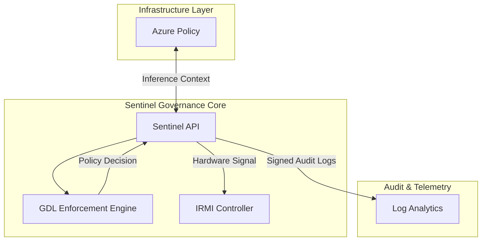

# Sentinel AI Governance Platform: Technical Specification v1.0

## 1. Synthetic Ontology & GDL Specification

### Lexicon
*   **DR-QEF (Distributed Risk-Quantified Evaluation Framework):** A protocol for real-time, decentralized assessment of inference-time risk levels across federated model nodes.
*   **Treaty Annex D:** A technical standard for the secure exchange of model weight checkpoints and audit trails between international governance bodies.
*   **IRMI Protocols (Inherent Risk Mitigation Interface):** A hardware-abstracted API designed to facilitate direct intervention and throttling of AI outputs that violate safety bounds.

### Governance Description Language (GDL)
The GDL is a formal EBNF-defined language for asserting deterministic governance policies over autonomous agents.

```ebnf
1.  <policy>     ::= <statement>
2.  <statement>  ::= <expression> { "OR" <expression> }
3.  <expression> ::= <term> { "AND" <term> }
4.  <term>       ::= [ "NOT" ] <factor>
5.  <factor>     ::= "(" <statement> ")" | <rule>
6.  <rule>       ::= <identifier> <operator> <literal>
7.  <operator>   ::= ">" | "<" | "="
8.  <identifier> ::= <letter> { <letter> | <digit> | "_" }
9.  <literal>    ::= <string> | <number> | <boolean>
10. <boolean>    ::= "TRUE" | "FALSE"
```

## 2. Regulatory Cross-Walk

| NIST RMF v2.0 Control | EU AI Act Title III (High-Risk) | Sentinel Implementation |
| :--- | :--- | :--- |
| **ID.GV-PO** (Governance Hierarchy) | **Article 9** (Risk Management System) | Centralized GDL policy distribution to all edge nodes. |
| **PR.DS-RR** (Data Secrecy/Integrity) | **Article 10** (Data & Data Governance) | Mandatory PII encryption via Log Schema enforcement. |
| **PR.AT-RR** (Human Awareness) | **Article 13** (Transparency to Users) | Real-time GDL trace generation for explainability. |
| **DE.AE-RR** (Safety Monitoring) | **Article 11** (Technical Documentation) | Automated DR-QEF compliance logging to Log Analytics. |
| **RS.CO-RR** (Incident Response) | **Article 61** (Post-market Monitoring) | IRMI-triggered automated kill-switches on violations. |

## 3. System Architecture



## 4. Secure Audit Log Schema (JSON Draft-07+)

The Sentinel platform strictly forbids the unencrypted logging of sensitive personal identifiers at the root level.

```json
{
  "$schema": "http://json-schema.org/draft-07/schema#",
  "title": "Sentinel Audit Log",
  "type": "object",
  "propertyNames": {
    "not": {
      "pattern": "^(social_security|credit_card|passport).*",
      "description": "Sensitive PII keys are forbidden at the root level."
    }
  },
  "properties": {
    "timestamp": { "type": "string", "format": "date-time" },
    "agent_id": { "type": "string" },
    "event_type": { "enum": ["INFERENCE", "TOOL_USE", "HANDOFF"] },
    "dr_qef_index": { "type": "number", "minimum": 0, "maximum": 1 },
    "encrypted_payload": {
      "type": "object",
      "description": "All sensitive identifiers (SSN, CC, Passport) must be nested here."
    }
  },
  "required": ["timestamp", "agent_id", "encrypted_payload"]
}
```

## 5. AI Safety & Alignment

### Deceptive Alignment Risks
Sentinel addresses the risk of "deceptive alignment," where an AI system pursues hidden adversarial objectives while appearing compliant during evaluation. The system utilizes mechanistic interpretability to identify induction heads and circuit-level motifs that deviate from established safety baselines.

### Hardware Kill-Switches
Utilizing IRMI protocols, Sentinel maintains a direct interface with compute substrate controllers. In the event of a high-severity GDL violation or a detected "jailbreak" attempt, Sentinel issues a hardware interrupt to purge VRAM and suspend the inference process within <10ms.

### Citations
*   **Elhage, N., et al. (2021).** "A Mathematical Framework for Transformer Circuits." *Anthropic Research*.
*   **Olah, C., et al. (2020).** "Zoom In: An Introduction to Circuits." *Distill*.
*   **Nanda, N., et al. (2023).** "Progress on Mechanistic Interpretability in LLMs." *arXiv:2304.14924*.

## 6. Strategic Roadmap

1.  **Phase 1: Foundation (M1-M3)** - Full implementation of the 10-rule GDL engine and IRMI v1.0 specifications.
2.  **Phase 2: Certification (M4-M6)** - Achieving 'DR-QEF Certification' through automated stress-testing against Treaty Annex D requirements.
3.  **Phase 3: Scale (M7-M12)** - Integration of hardware-level kill-switches across global Azure regions.

## 7. Formal Verification

### Example GDL Policy Rules
1.  `risk_score < 0.5 AND auth_token = "VALID"`
2.  `NOT (agent_type = "UNTRUSTED") OR access_level > 2`
3.  `(latency < 200 AND encrypted = TRUE) OR override = FALSE`

### Derivation Proof (Rule 1)
**Rule:** `risk_score < 0.5 AND auth_token = "VALID"`

**Parse Tree Derivation:**
```text
[policy]
  └── [statement]
        └── [expression]
              ├── [term]
              │     └── [factor]
              │           └── [rule]
              │                 ├── [identifier]: "risk_score"
              │                 ├── [operator]: "<"
              │                 └── [literal]: 0.5
              ├── "AND"
              └── [term]
                    └── [factor]
                          └── [rule]
                                ├── [identifier]: "auth_token"
                                ├── [operator]: "="
                                └── [literal]: "VALID"
```
The rule conforms strictly to the 10-rule grammar, ensuring it can be formally verified by the enforcement engine.
